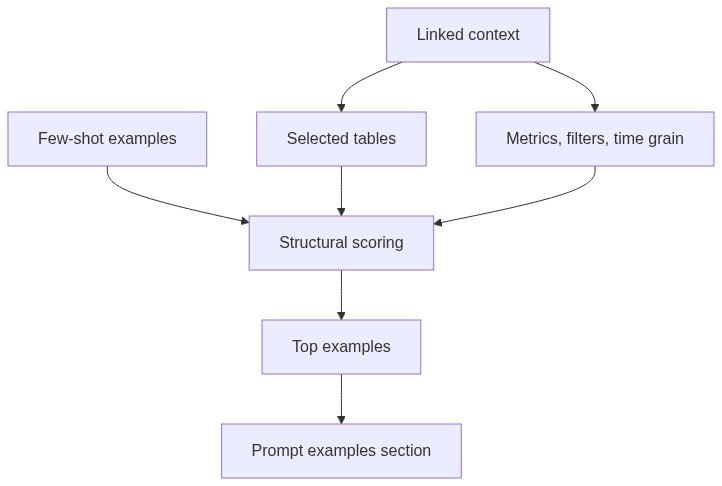

# Example Retrieval Module

## Purpose

`src/beacon/linking/example_retrieval.py` ranks few-shot SQL examples by structural overlap with the linked context.

## Inputs

- Original question.
- Example dictionaries or example docs.
- Linked context from `schema_linking.py`.

## Outputs

A ranked list of examples for the SQL prompt.

## Important Functions

- `rank_examples(question, examples, linked_context, limit=2)`
- `score_example(example, linked_context)`

## Diagram

## Failure Behavior

Examples with zero score are omitted. Missing examples do not block SQL generation.

## Tests

Protected by `tests/test_example_retrieval.py`.
