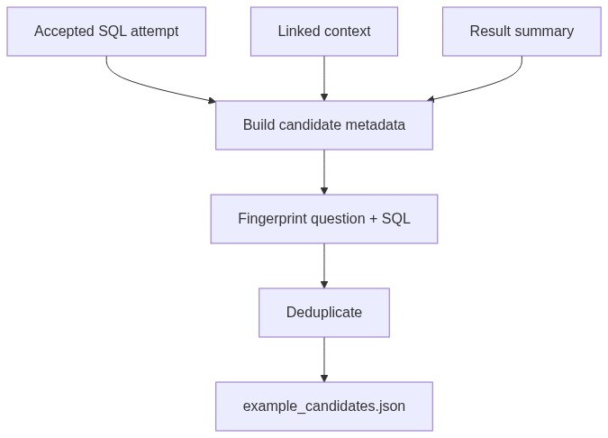

# Feedback Examples Module

## Purpose

`src/beacon/runtime/feedback_examples.py` saves accepted SQL attempts as candidate examples for future few-shot use.

## Inputs

- Original question.
- Accepted SQL attempt.
- Execution result summary.
- Linked context.

## Outputs

A deduplicated JSON candidate in `data/example_candidates.json` when `BEACON_SAVE_EXAMPLE_CANDIDATES=1`.

## Important Functions

- `candidate_from_attempt(question, attempt, result, linked_context)`
- `save_candidate_example(path, candidate)`

## Diagram

## Failure Behavior

The pipeline only calls this module when the environment flag is enabled. Candidate saving is not required for answering a question.

## Tests

Protected by `tests/test_feedback_examples.py`.
