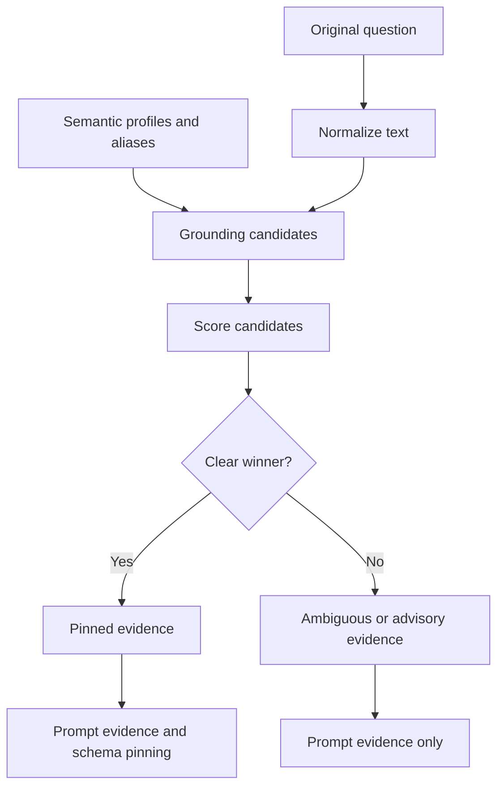

# Metadata Grounding Module

## Purpose

`src/beacon/metadata_grounding.py` maps user terms to exact database values, tables, and columns using semantic profiles and aliases.

## Inputs

- User question text.
- Semantic model with column profiles, sample values, top values, and optional aliases.

## Outputs

A list of evidence dictionaries. Each evidence item includes the term, table, column, exact value, SQL literal, source, score, confidence, status, pin flag, and reasons.

## Important Functions

- `ground_question_metadata(question, semantic_model, settings=None)`
- `score_grounding_candidates(candidates)`
- `apply_grounding_to_needs(needs, evidence)`
- `format_matched_evidence(evidence)`

## Diagram

## Failure Behavior

Ambiguous evidence is not pinned. It can still be shown to the LLM as context, but it will not force table selection.

## Tests

Protected by `tests/test_metadata_grounding.py`.
