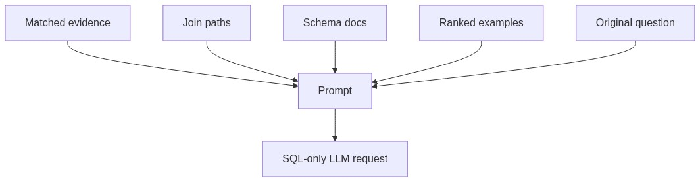

# Prompting Module

## Purpose

`src/beacon/runtime/prompting.py` owns the SQL-generation prompt layout.

## Inputs

- Original question.
- Linked context with evidence, join paths, schema docs, and examples.

## Outputs

A plain-text prompt ending with `SQL:`.

## Important Functions

- `build_sql_prompt(question, context)`
- `format_example_doc(doc)`

## Diagram

## Failure Behavior

Missing evidence or examples are simply omitted. The schema section is always present, even if empty, so prompt shape remains stable.

## Tests

Protected by `tests/test_prompting.py`.
