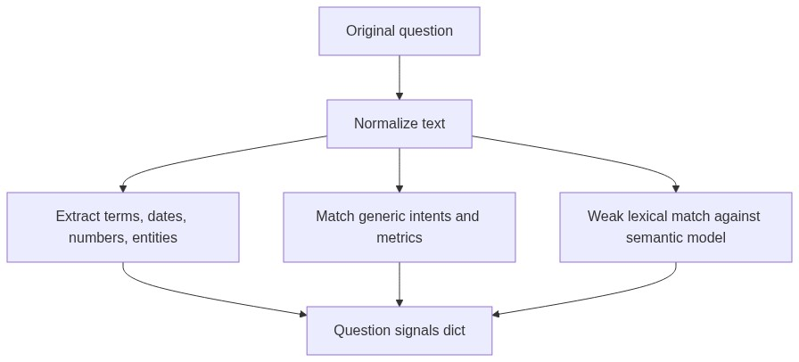

# Question Signals Module

## Purpose

`src/beacon/linking/question_signals.py` extracts database-agnostic hints from the original question. It replaces the old idea that the first step should choose exact tables by hardcoded keywords.

## Inputs

- User question text.
- Optional semantic model for weak lexical matches against table and column descriptions.

## Outputs

A plain dictionary containing terms, entities, dates, numbers, intents, metrics, filters, time grain, weak table matches, weak column matches, and reasons.

## Important Functions

- `extract_question_signals(question, semantic_model=None)`
- `extract_dates(text)`
- `extract_numbers(text)`
- `weak_schema_matches(text, semantic_model)`

## Diagram

## Failure Behavior

If no signal is found, the module returns empty sets/lists rather than failing. Schema linking can still use vector retrieval and metadata grounding.

## Tests

Protected by `tests/test_question_signals.py`.
