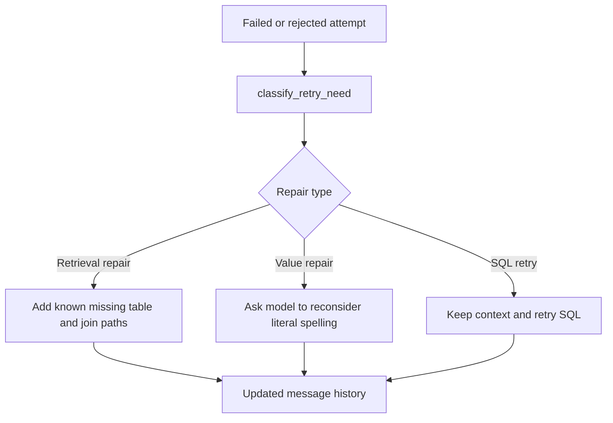

# Retry Module

## Purpose

`src/beacon/retry.py` decides whether a failed attempt needs SQL-only retry, retrieval repair, or value repair.

## Inputs

- Latest attempt dictionary.
- Known schema table names.
- Linked context and semantic model for repair.

## Outputs

- Retry decision dictionary.
- Repaired linked context when a known missing table should be added.
- Prompt message explaining the repair.

## Important Functions

- `classify_retry_need(attempt, known_schema)`
- `repair_linked_context(context, decision, semantic_model)`
- `format_retry_context_update(context, decision)`

## Diagram

## Failure Behavior

Unknown missing tables are not added. The pipeline falls back to ordinary SQL retry when no specific repair is available.

## Tests

Protected by `tests/test_dynamic_retry.py` and `tests/test_retry_pipeline.py`.
