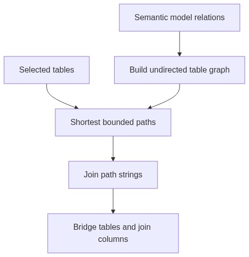

# Schema Graph Module

## Purpose

`src/beacon/linking/schema_graph.py` turns semantic model relations into a table graph and finds join paths for selected tables.

## Inputs

- Semantic model tables.
- Selected table names.
- Maximum hop count.

## Outputs

- Graph dictionary with tables and edges.
- Ordered join-path strings such as `orders.order_id -> order_items.order_id`.

## Important Functions

- `build_schema_graph(semantic_model)`
- `relation_paths(graph, selected_tables, max_hops=2)`
- `shortest_relation_path(graph, start, end, max_hops)`
- `tables_in_relations(relations)`

## Diagram

## Failure Behavior

If no bounded path exists, the module returns no relation for that pair. It does not invent joins.

## Tests

Protected by `tests/test_schema_graph.py`.
