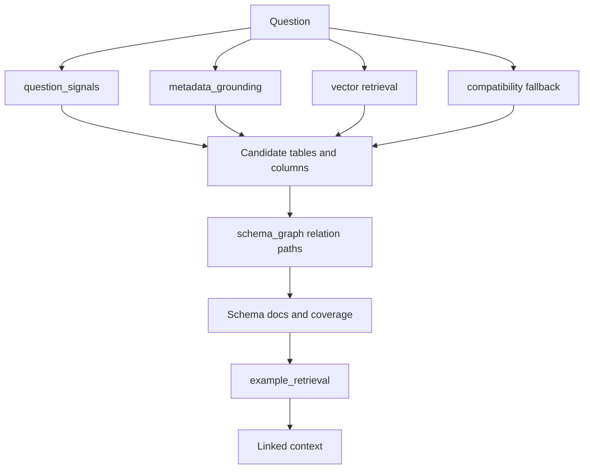

# Schema Linking Module

## Purpose

`src/beacon/schema_linking.py` turns one natural-language question and one semantic model into linked schema context for SQL generation.

## Inputs

- Original question.
- Semantic model tables.
- Local vector index.
- Optional few-shot examples.

## Outputs

Plain dictionary with question signals, evidence, selected tables, selected columns, join paths, schema docs, example docs, and coverage.

## Important Functions

- `link_schema(question, semantic_model, vector_index_dir, embedder, few_shot_examples, top_k)`
- `retrieve_vector_hits(...)`
- `filtered_fallback_needs(question, semantic_model)`
- `assess_linked_coverage(...)`

## Diagram

## Failure Behavior

If local vector files are missing or the production embedder is unavailable, the module falls back to an in-memory hash index. If no table is selected, coverage is marked insufficient.

## Tests

Protected by `tests/test_schema_linking.py`.
