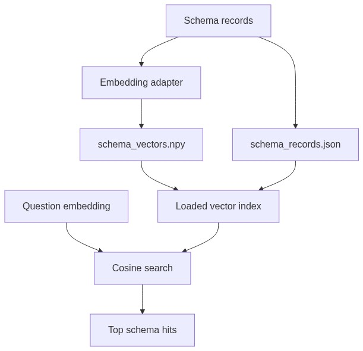

# Vector Store Module

## Purpose

`src/beacon/linking/vector_store.py` provides a small local NumPy-backed vector store for schema retrieval.

## Inputs

- Schema records from `schema_index.py`.
- Embedding vectors from `embeddings.py`.
- Query vector at search time.

## Outputs

Search results with the original record and cosine score.

## Important Functions

- `save_vector_index(index_dir, records, vectors, manifest)`
- `load_vector_index(index_dir)`
- `vector_index_exists(index_dir)`
- `search_vector_index(index, query_vector, top_k=10)`

## Diagram

## Failure Behavior

The store returns an empty result for empty vectors. `schema_linking.py` can build an in-memory hash index when persisted files are missing.

## Tests

Protected by `tests/test_vector_store.py`.
