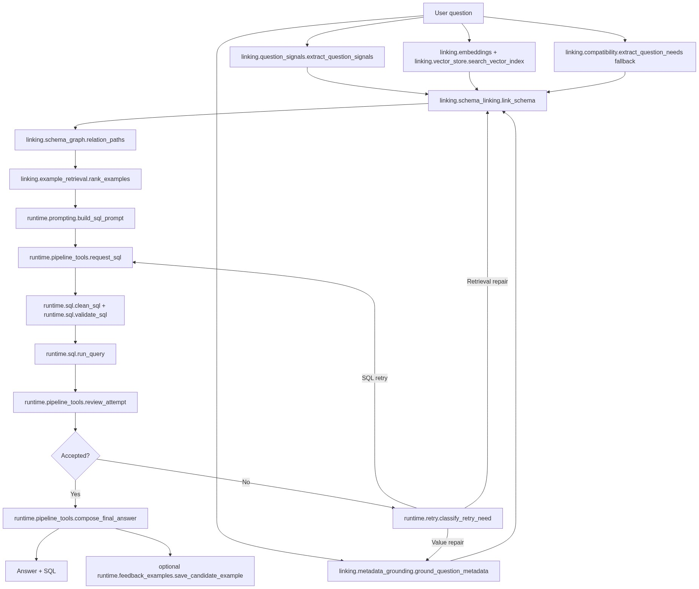
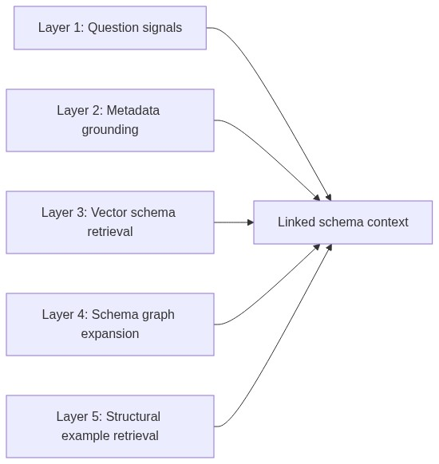
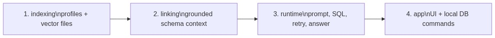

# Beacon Pipeline

Beacon is a retrieval-augmented Text-to-SQL pipeline. The runtime path keeps the original user question intact, builds grounded schema context, asks for one read-only PostgreSQL query, validates and executes it, then reviews the result before answering.

For the source-file review order, see `docs/source_layout.md`.

## Full Pipeline

## Retrieval Layers

## Source Order

## Runtime Contract

SQL generation returns SQL only. Beacon does not ask the model to return visible chain-of-thought before SQL. Retry state is carried through the in-request message history using validation errors, execution errors, result summaries, reviewer JSON, and retrieval/value repair messages.

## Compatibility Note

`beacon.retrieval_tools.extract_question_needs()` remains available as a root compatibility import for the original demo schema. The implementation now lives in `beacon.linking.compatibility`. New Spider-Snow-specific table rules should not be added there; generalization belongs in semantic metadata, vector records, question signals, and schema graph expansion.
