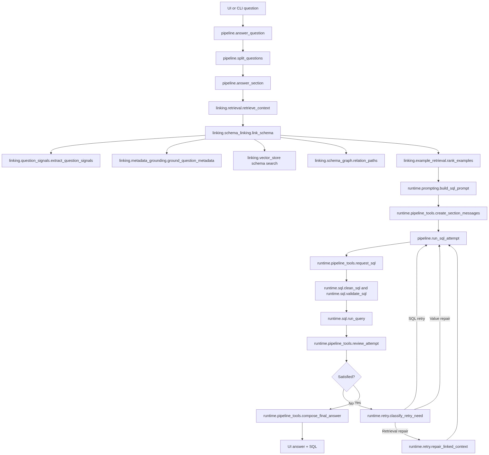
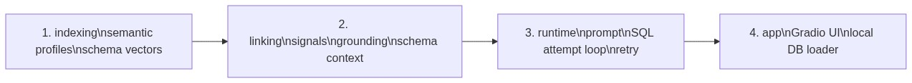
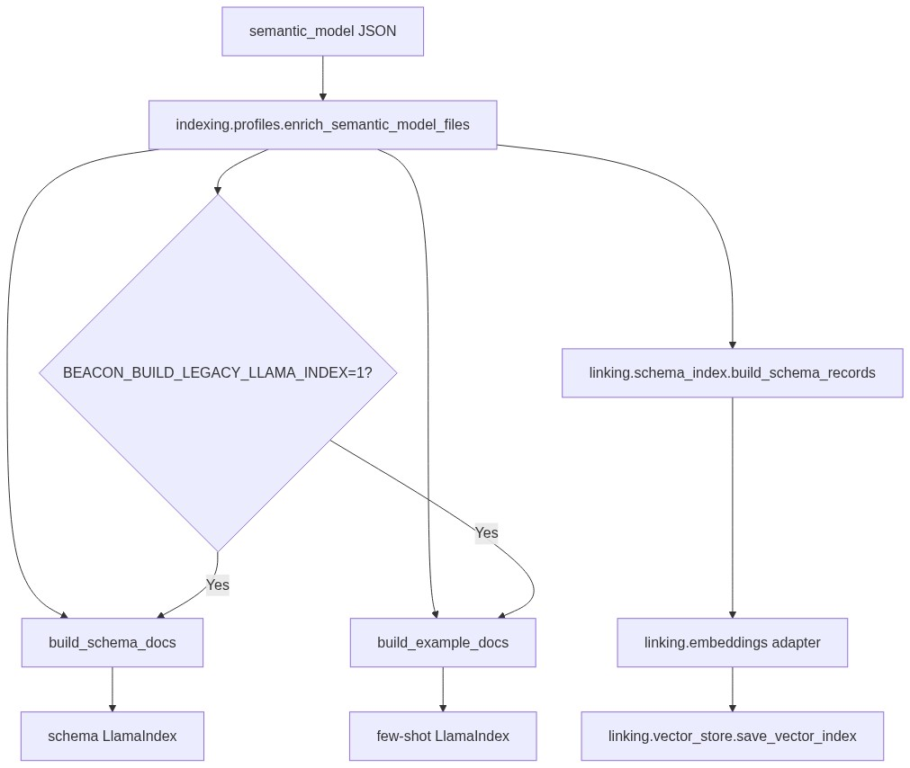
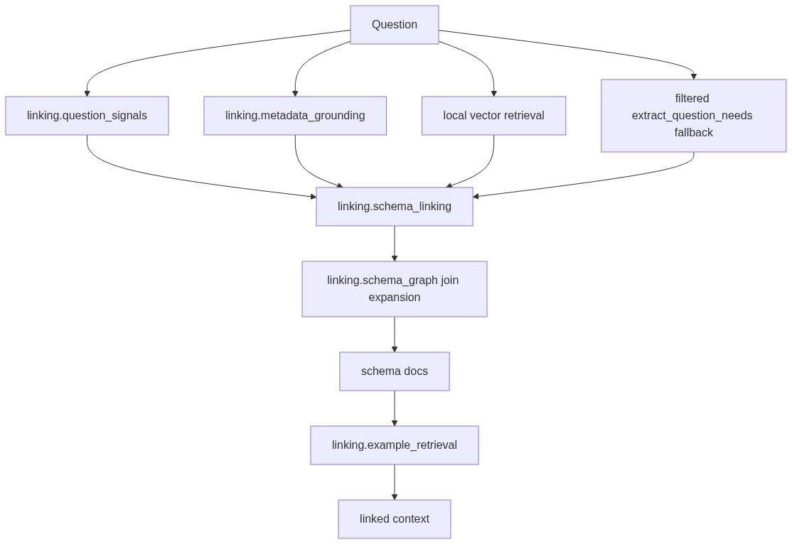
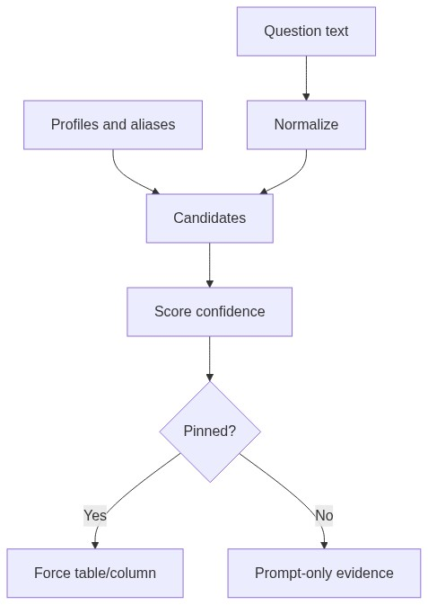

# Beacon Pipeline Deep Dive

Project root:

`E:\AI Thuc Chien\VSF\basic-mvp`

Main package:

`E:\AI Thuc Chien\VSF\basic-mvp\src\beacon`

## Correct Commands

Run commands from the repo root through `uv run`:

```powershell
Set-Location -LiteralPath 'E:\AI Thuc Chien\VSF\basic-mvp'
```

Build indices:

```powershell
uv run python -m beacon.indexing
```

Load local PostgreSQL data:

```powershell
uv run python -m beacon.load_db
```

Run the UI:

```powershell
uv run python -m beacon.ui
```

Run the CLI:

```powershell
uv run python -m beacon.pipeline 'How much revenue did we make by category?'
```

Run tests:

```powershell
uv run pytest tests -v
```

## High-Level Flow



## Source Order

The implementation is split into four layer folders under `src/beacon/`.



Root files such as `src/beacon/pipeline.py`, `src/beacon/retrieval.py`, `src/beacon/ui.py`, and `src/beacon/load_db.py` are compatibility entrypoints. They delegate to the layer folders so existing commands keep working.

## Runtime Entry Points

`src/beacon/ui.py` delegates to `src/beacon/app/ui.py`.

- `handle_question(question)` calls `beacon.pipeline.ask_database(question)`.
- `main()` launches Gradio.

`src/beacon/pipeline.py` delegates to `src/beacon/runtime/pipeline.py`.

- `answer_question(question)` is the main structured API.
- `ask_database(question)` returns the UI-friendly `(answer, sql)` tuple.
- `main()` reads the CLI question and prints the answer.

## Configuration

`src/beacon/config.py` owns repo paths and environment-backed settings.

Important paths:

- `data/semantic_model/`
- `data/few_shot_queries.json`
- `data/indices/schema/`
- `data/indices/few_shot/`
- `data/indices/local_vectors/`
- `data/example_candidates.json`

Important environment variables:

- `OPENAI_API_KEY`
- `OPENAI_API_BASE`
- `SQL_AGENT_LLM_STRONG_MODEL`
- `PGHOST`
- `PGPORT`
- `PGUSER`
- `PGPASSWORD`
- `PGDATABASE`
- `BEACON_SAVE_EXAMPLE_CANDIDATES`
- `BEACON_EMBEDDING_MODEL`
- `BEACON_USE_HASH_EMBEDDINGS`

## Indexing Pipeline

Entry file:

`src/beacon/indexing/__main__.py`

Indexing always builds Beacon's local schema vector artifact:

- Beacon local schema vectors under `data/indices/local_vectors/`.

Set `BEACON_BUILD_LEGACY_LLAMA_INDEX=1` to also rebuild the older LlamaIndex artifacts:

- LlamaIndex schema docs under `data/indices/schema/`.
- LlamaIndex few-shot docs under `data/indices/few_shot/`.



The local vector index uses `sentence-transformers` by default. Tests and offline runs can use `BEACON_USE_HASH_EMBEDDINGS=1`.

## Retrieval Pipeline

Entry file:

`src/beacon/retrieval.py` delegates to `src/beacon/linking/retrieval.py`.

Primary implementation:

`src/beacon/linking/schema_linking.py`

Call path:

1. Load semantic model.
2. Build few-shot example docs.
3. Call `linking.schema_linking.link_schema(...)`.
4. Return compatibility fields expected by `runtime.pipeline`: `question_needs`, `schema_docs`, `example_docs`, `schema_coverage`, and `matched_evidence`.



The old `retrieval_tools.extract_question_needs()` remains as a compatibility fallback while the hybrid linker is evaluated. It should not receive new database-specific Spider-Snow table rules.

## Metadata Grounding

`src/beacon/linking/metadata_grounding.py` maps question terms to table/column/value evidence.

Evidence status:

- `pinned`: strong enough to force schema inclusion.
- `ambiguous`: shown to the LLM but not pinned.
- `candidate`: useful context, not forced.



## SQL Attempt Loop

`runtime.pipeline.answer_section()` retrieves context once, then loops through up to `MAX_SQL_ATTEMPTS = 3`.

One attempt:

1. Request SQL only.
2. Clean SQL.
3. Validate read-only safety and table grounding.
4. Execute in PostgreSQL read-only transaction.
5. Review result or error with strict JSON.
6. Retry only if needed.

Retry repair:

- SQL retry keeps the same context.
- Value repair asks the model to reconsider exact literal spelling.
- Retrieval repair adds known missing tables and join paths to the linked context before the next SQL attempt.

## SQL Safety

`src/beacon/runtime/sql.py` still validates with readable regex-based checks:

- only `SELECT` or `WITH`
- single statement
- no write/admin keywords
- no unsafe server functions
- no referenced tables outside selected schema context

Execution uses:

- PostgreSQL read-only transaction
- repeatable read isolation
- local statement timeout
- count query plus bounded preview rows

## Feedback Examples

If `BEACON_SAVE_EXAMPLE_CANDIDATES=1`, accepted SQL attempts are written to `data/example_candidates.json`.

These are candidate examples only. They should be reviewed before promotion to `data/few_shot_queries.json`.

## Design Decisions

Beacon still uses plain dictionaries and small modules. The new retrieval stack is modular, but it deliberately avoids Pydantic, large orchestration layers, and framework-heavy abstractions.

The important architectural shift is that hardcoded keyword rules are no longer the primary retrieval layer. They are filtered fallback signals; generalization comes from semantic metadata, vector schema records, evidence confidence, and schema graph expansion.
