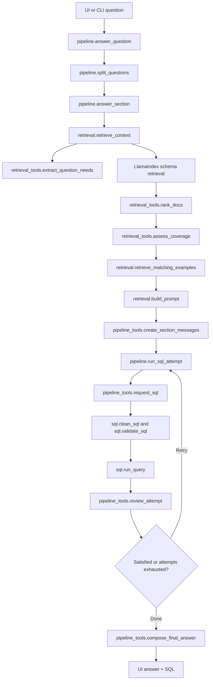

# Beacon Pipeline Deep Dive

This document explains the current Beacon code path in enough detail to defend the method and codebase in review.

Project root:

`E:\AI Thuc Chien\VSF\basic-mvp`

Main package:

`E:\AI Thuc Chien\VSF\basic-mvp\src\beacon`

## Correct UI Commands

The screenshot error happened because `python beacon\ui.py` was run from `E:\AI Thuc Chien\VSF\basic-mvp\src`, and Python did not resolve `beacon` as an importable package before the recent entrypoint fix.

Recommended package command:

```powershell
Set-Location -LiteralPath 'E:\AI Thuc Chien\VSF\basic-mvp'
$env:PYTHONPATH = 'E:\AI Thuc Chien\VSF\basic-mvp\src'
python -m beacon.ui
```

Direct script command, now also supported:

```powershell
python 'E:\AI Thuc Chien\VSF\basic-mvp\src\beacon\ui.py'
```

CLI command:

```powershell
Set-Location -LiteralPath 'E:\AI Thuc Chien\VSF\basic-mvp'
$env:PYTHONPATH = 'E:\AI Thuc Chien\VSF\basic-mvp\src'
python -m beacon.pipeline 'How much revenue did we make by category?'
```

Index rebuild command:

```powershell
Set-Location -LiteralPath 'E:\AI Thuc Chien\VSF\basic-mvp'
$env:PYTHONPATH = 'E:\AI Thuc Chien\VSF\basic-mvp\src'
python -m beacon.indexing
```

Database load command:

```powershell
Set-Location -LiteralPath 'E:\AI Thuc Chien\VSF\basic-mvp'
$env:PYTHONPATH = 'E:\AI Thuc Chien\VSF\basic-mvp\src'
python -m beacon.load_db
```

## High-Level Flow



## Runtime Entry Points

### UI

File:

`E:\AI Thuc Chien\VSF\basic-mvp\src\beacon\ui.py`

Important functions and objects:

- `demo`: a `gradio.Blocks` object containing the interface.
- `handle_question(question: str) -> tuple[str, str]`: receives UI input, calls `ask_database()`, and returns answer text plus SQL text.
- `main() -> None`: launches Gradio with `demo.launch()`.

Call path:

1. User opens Gradio UI.
2. User submits a question through `question_box.submit(...)` or `submit_btn.click(...)`.
3. Gradio calls `handle_question(question)`.
4. `handle_question()` strips empty input and calls `beacon.pipeline.ask_database(question)`.
5. The returned answer and SQL are displayed in `answer_box` and `sql_box`.

Classes used:

- `gradio.Blocks`
- `gradio.Markdown`
- `gradio.Textbox`
- `gradio.Button`
- `gradio.Code`

Implementation note:

- `ui.py` now inserts `E:\AI Thuc Chien\VSF\basic-mvp\src` into `sys.path` when run directly as a script. This keeps direct execution working without adding root-level wrapper scripts.

### CLI

File:

`E:\AI Thuc Chien\VSF\basic-mvp\src\beacon\pipeline.py`

Important functions:

- `main()`: reads the CLI question from `sys.argv` or prompts interactively.
- `ask_database(question)`: returns the UI-friendly `(answer, sql)` tuple.

Call path:

1. `python -m beacon.pipeline "question"` runs `pipeline.main()`.
2. `main()` calls `ask_database(question)`.
3. `ask_database()` calls `answer_question(question)`.

## Configuration And Paths

File:

`E:\AI Thuc Chien\VSF\basic-mvp\src\beacon\config.py`

Constants:

- `PROJECT_ROOT = E:\AI Thuc Chien\VSF\basic-mvp`
- `DATA_DIR = E:\AI Thuc Chien\VSF\basic-mvp\data`
- `PROCESSED_DATA_DIR = E:\AI Thuc Chien\VSF\basic-mvp\data\processed`
- `SEMANTIC_MODEL_DIR = E:\AI Thuc Chien\VSF\basic-mvp\data\semantic_model`
- `FEW_SHOT_QUERIES_PATH = E:\AI Thuc Chien\VSF\basic-mvp\data\few_shot_queries.json`
- `SCHEMA_INDEX_DIR = E:\AI Thuc Chien\VSF\basic-mvp\data\indices\schema`
- `FEW_SHOT_INDEX_DIR = E:\AI Thuc Chien\VSF\basic-mvp\data\indices\few_shot`
- `SQL_DIR = E:\AI Thuc Chien\VSF\basic-mvp\sql`

Functions:

- `get_db_kwargs(env=None)`: builds the `psycopg2.connect(...)` argument dictionary from `PGHOST`, `PGPORT`, `PGUSER`, `PGPASSWORD`, and `PGDATABASE`.
- `load_settings()`: loads `.env`, then returns OpenAI settings, selected model, and database settings.

Environment variables used:

- `OPENAI_API_KEY`
- `OPENAI_API_BASE`
- `SQL_AGENT_LLM_STRONG_MODEL`
- `PGHOST`
- `PGPORT`
- `PGUSER`
- `PGPASSWORD`
- `PGDATABASE`

## Indexing Pipeline

Entry file:

`E:\AI Thuc Chien\VSF\basic-mvp\src\beacon\indexing.py`

Helper file:

`E:\AI Thuc Chien\VSF\basic-mvp\src\beacon\indexing_tools.py`

Purpose:

Build two persisted LlamaIndex vector indices:

- schema index at `E:\AI Thuc Chien\VSF\basic-mvp\data\indices\schema`
- few-shot example index at `E:\AI Thuc Chien\VSF\basic-mvp\data\indices\few_shot`

### Call Chain

1. `indexing.main()`
2. `indexing.build_indices()`
3. `indexing.configure_embeddings()`
4. `indexing_tools.enrich_semantic_model_files()`
5. `indexing_tools.load_json(FEW_SHOT_QUERIES_PATH)`
6. `indexing_tools.build_schema_docs(semantic_model)`
7. `indexing.persist_index(schema_docs, SCHEMA_INDEX_DIR)`
8. `indexing_tools.build_example_docs(few_shot, semantic_model)`
9. `indexing.persist_index(example_docs, FEW_SHOT_INDEX_DIR)`

### Classes Used

From LlamaIndex:

- `llama_index.core.Document`
- `llama_index.core.VectorStoreIndex`
- `llama_index.core.Settings`
- `llama_index.embeddings.openai.OpenAIEmbedding`

### Semantic Enrichment Mechanics

`enrich_semantic_model_files()` loads every table JSON from:

`E:\AI Thuc Chien\VSF\basic-mvp\data\semantic_model`

Then it profiles matching CSVs from:

`E:\AI Thuc Chien\VSF\basic-mvp\data\processed`

Important helper functions:

- `load_semantic_model(model_dir)`
- `enrich_semantic_model(model, data_dir)`
- `profile_csv_file(path, columns)`
- `new_profile_state(column)`
- `update_profile_state(state, value)`
- `finish_profile_state(state)`

Implemented profiling algorithm:

1. Stream each CSV row with `csv.DictReader`.
2. Keep exactly the first 3 rows as `sample_rows`.
3. For each column, track:
   - `null_count`
   - `distinct_values`
   - up to 5 `sample_values`
   - `Counter` for categorical/boolean values
   - numeric values for min/max/mean
   - date min/max
4. Convert the mutable state into compact JSON:
   - all columns get `null_count`, `distinct_count`, `sample_values`
   - date columns get `min` and `max`
   - numeric non-ID columns get `min`, `max`, and `mean`
   - numeric ID/key-like columns get `min` and `max`, but no `mean`
   - booleans get `value_counts`
   - text/categorical columns get top 5 values with counts

Why this is implemented:

- It gives the LLM enough data context to map values and understand ranges.
- It avoids dumping entire tables into prompts.
- It keeps metadata readable in `data/semantic_model/*.json`.

### Schema Document Construction

Function:

`indexing_tools.build_schema_docs(semantic_model)`

For each table, it creates one retrieval document containing:

- table name
- semantic name
- grain
- description
- columns with descriptions and compact profiles
- relations
- sample rows

Each schema document metadata contains:

- `table`
- `columns`
- `relations`
- `question_families`

### Example Document Construction

Function:

`indexing_tools.build_example_docs(few_shot, semantic_model)`

For each few-shot example, it creates one retrieval document containing:

- question
- SQL
- tables used
- pattern
- important columns
- metrics
- filters
- time grain
- question families

Important helper functions:

- `collect_column_names(semantic_model)`
- `extract_example_signals(example, known_columns)`
- `infer_example_columns(example, known_columns)`
- `matching_signal_labels(text, rules)`
- `first_matching_signal(text, rules)`

Signal extraction algorithm:

- Match simple phrase rules in `SIGNAL_RULES`.
- Extract:
  - metrics such as `revenue`, `cogs`, `count`, `average`, `fill_rate`
  - filters such as `date_filter`, `payment_filter`, `status_filter`
  - time grain such as `day`, `month`, `quarter`, `year`
- Prefer known semantic column names when detecting important columns.

Why this is implemented:

- Example retrieval becomes more semantic than plain text similarity.
- The prompt can include examples that match tables, metrics, filters, and time grain.

## Retrieval Pipeline

Entry file:

`E:\AI Thuc Chien\VSF\basic-mvp\src\beacon\retrieval.py`

Helper file:

`E:\AI Thuc Chien\VSF\basic-mvp\src\beacon\retrieval_tools.py`

Purpose:

Turn one natural-language question into:

- inferred question needs
- relevant schema docs
- relevant example docs
- coverage assessment
- final prompt text

### Call Chain

From `pipeline.answer_section(question, settings)`:

1. `retrieval.retrieve_context(question)`
2. `retrieval_tools.extract_question_needs(question)`
3. `retrieval.load_indices()`
4. `retrieval.retrieve_schema_until_covered(schema_index, question, needs)`
5. `retrieval.retrieve_nodes(schema_index, question, k)`
6. `retrieval_tools.rank_docs(question, retrieved, needs)`
7. `retrieval_tools.assess_coverage(needs, schema_docs)`
8. `retrieval.retrieve_matching_examples(example_index, question, needs, coverage)`
9. `retrieval_tools.matching_examples(...)`
10. `retrieval_tools.assess_coverage(needs, schema_docs, example_docs)`
11. return context dictionary
12. `retrieval.build_prompt(question, context)`

### Classes Used

From LlamaIndex:

- `llama_index.core.Settings`
- `llama_index.core.StorageContext`
- `llama_index.core.load_index_from_storage`
- `llama_index.embeddings.openai.OpenAIEmbedding`

### Question Understanding

Function:

`retrieval_tools.extract_question_needs(question)`

It returns a plain dictionary:

```python
{
    "tables": set[str],
    "columns": set[str],
    "relations": set[str],
    "example_patterns": set[str],
}
```

Mechanics:

- Normalize question to lowercase.
- Apply phrase-trigger rules:
  - `TABLE_RULES`
  - `COLUMN_RULES`
  - `PATTERN_RULES`
- Apply special routing helpers:
  - `apply_date_rules(...)`
  - `apply_revenue_rules(...)`
  - `apply_geography_rules(...)`
  - `apply_inventory_rules(...)`
- Compute needed joins with `required_relations(tables)`.

Important design decision:

- This is intentionally simple rule-based extraction, not a learned selector.
- The upside is readability and easy debugging.
- The downside is lower recall for synonyms, Vietnamese, and unseen business terms.

### Schema Retrieval Expansion

Function:

`retrieve_schema_until_covered(schema_index, question, needs)`

Algorithm:

1. Start with `SCHEMA_K_START = 2`.
2. Retrieve top-k schema nodes using vector similarity.
3. Re-rank the returned docs with `rank_docs(...)`.
4. Run `assess_coverage(...)`.
5. If coverage is sufficient, stop.
6. Otherwise increase k until `SCHEMA_K_MAX = 5`.

Why this exists:

- It keeps prompts compact for easy questions.
- It expands context when the first retrieval result is insufficient.
- It avoids always stuffing every table into the prompt.

### Ranking Algorithm

Functions:

- `rank_docs(question, docs, needs, limit=None)`
- `score_doc(question, doc, needs)`
- `token_overlap(question, text)`
- `question_terms(question)`
- `metadata_values(metadata, *keys)`

Scoring:

- base score: token overlap between meaningful question terms and document text
- `+5` per needed table found in document metadata
- `+3` per needed column found in metadata
- `+4` per matching example pattern
- `+2` per overlap with metadata signals like question families, metrics, or filters

Why this exists:

- Vector retrieval gives candidate docs.
- Simple metadata scoring makes the ranking explainable.
- If a senior asks why a document ranked high, the answer is visible in metadata overlap.

### Coverage Assessment

Function:

`assess_coverage(needs, schema_docs, example_docs=None)`

It checks:

- tables covered by schema doc metadata
- columns covered by schema doc metadata or visible column text
- relations covered by schema doc metadata or visible relation text
- whether any retrieved example pattern matches the inferred patterns

Returns:

```python
{
    "is_sufficient": bool,
    "missing": {
        "tables": list[str],
        "columns": list[str],
        "relations": list[str],
    },
    "example_match": bool,
}
```

Important behavior:

- Missing schema coverage blocks SQL generation before the retry loop.
- Missing examples do not block SQL generation.
- This is why retrieval quality matters: validation later only allows tables from `needs["tables"]`.

### Example Retrieval

Function:

`retrieve_matching_examples(example_index, question, needs, coverage)`

Algorithm:

1. Only retrieve examples if schema coverage is sufficient.
2. Only retrieve examples if `needs["example_patterns"]` is non-empty.
3. Try top-k examples from `EXAMPLE_K_START = 1` to `EXAMPLE_K_MAX = 2`.
4. Keep examples whose metadata `pattern` matches an inferred question pattern.

Why this exists:

- Bad examples can distract the LLM.
- Examples are enrichment, not required context.

### Prompt Assembly

Function:

`build_prompt(question, context)`

Prompt shape:

1. `RELEVANT SCHEMA:`
2. schema docs
3. optional `EXAMPLE QUERIES:`
4. matching examples
5. `QUESTION: ...`
6. `SQL:`

The prompt is plain text separated by:

`---`

## Core Answer Pipeline

File:

`E:\AI Thuc Chien\VSF\basic-mvp\src\beacon\pipeline.py`

Helper file:

`E:\AI Thuc Chien\VSF\basic-mvp\src\beacon\pipeline_tools.py`

Purpose:

Run the end-to-end NL-to-SQL process:

`question -> retrieve context -> prompt -> SQL -> validate -> execute -> review -> retry -> final answer`

### Public Functions

- `answer_question(question: str) -> dict`
- `ask_database(question: str) -> tuple[str, str | None]`

These are the two main public APIs.

### Question Splitting

Function:

`split_questions(question)`

Algorithm:

- Normalize whitespace.
- If the question contains dependent words like `subtract`, `difference`, `compare`, `versus`, `vs`, `second`, or `2nd`, do not split.
- Otherwise split on `and` only when the next phrase starts with a question/action word like `show`, `list`, `what`, `which`, `how`, `give`, or `find`.

Why this exists:

- It supports simple independent multi-step questions.
- It avoids splitting dependent reasoning where the second part depends on the first.

### `answer_question`

Function:

`answer_question(question)`

Call path:

1. Strip empty input.
2. Load settings with `load_settings()`.
3. Split the question with `split_questions(...)`.
4. Call `answer_section(part, settings)` for each section.
5. Aggregate section statuses:
   - all completed -> `completed`
   - some completed -> `partial`
   - none completed -> `failed`

Return shape:

```python
{
    "status": "completed" | "partial" | "failed",
    "question": str,
    "sections": list[dict],
}
```

### `answer_section`

Function:

`answer_section(question, settings)`

Call path:

1. `retrieve_context(question)`
2. Check if any table was inferred.
3. Check schema coverage.
4. `build_prompt(question, context)`
5. `create_section_messages(question, prompt)`
6. Loop through up to `MAX_SQL_ATTEMPTS = 3`:
   - `run_sql_attempt(...)`
   - if accepted, `safe_compose_final_answer(...)`
7. If all attempts fail, compose a failure answer with the final attempt context.

Important return fields:

- `title`
- `status`
- `answer`
- `sql`
- `error`
- `attempt_count`
- `attempts`

### Stateful Retry Loop

Files:

- `E:\AI Thuc Chien\VSF\basic-mvp\src\beacon\pipeline.py`
- `E:\AI Thuc Chien\VSF\basic-mvp\src\beacon\pipeline_tools.py`

Constant:

`MAX_SQL_ATTEMPTS = 3`

Meaning:

- 1 original attempt
- 2 retries

State:

- One `messages` list per section.
- The list is not saved after `answer_section()` returns.
- Split sections do not share message memory.

Message memory includes:

- system instruction
- original question
- retrieved schema/example prompt
- generated SQL attempts
- validation or execution errors
- result samples
- reviewer JSON
- final answer instruction

### One Attempt

Function:

`run_sql_attempt(question, settings, needs, messages, attempt_number)`

Call path:

1. `request_sql(messages, settings, attempt_number, call_llm)`
2. `clean_sql(raw_sql)`
3. `validate_sql(cleaned_sql, needs["tables"])`
4. `run_query(validated_sql, settings)`
5. `review_attempt(messages, settings, question, attempt, result, call_llm)`
6. Return `(attempt, result)`

Attempt shape:

```python
{
    "sql": str | None,
    "status": "generated" | "completed" | "validation_error" | "execution_error",
    "error": str | None,
    "review_reason": str | None,
    "satisfied": bool,
}
```

Public attempt shape is produced by:

`pipeline_tools.public_attempt(attempt)`

### LLM Calls

File:

`E:\AI Thuc Chien\VSF\basic-mvp\src\beacon\pipeline_tools.py`

Function:

`call_llm(messages, settings)`

Class used:

- `openai.OpenAI`

Mechanics:

- Uses the configured OpenAI-compatible model from `SQL_AGENT_LLM_STRONG_MODEL`.
- Uses `temperature=0`.
- Sends the full in-section `messages` list each time.

Important point:

- The LLM is stateful only within the current request because the code resends the growing message history.
- There is no persistent memory across sessions.

### SQL Request

Function:

`request_sql(messages, settings, attempt_number, chat)`

Mechanics:

- Appends a user message asking for exactly one read-only PostgreSQL `SELECT` or `WITH` query.
- Calls `chat(messages, settings)`.
- Appends the assistant SQL response back into `messages`.

### Review Request

Function:

`review_attempt(messages, settings, question, attempt, result, chat)`

Mechanics:

- Appends validation/execution status, SQL, error, and result summary to the same message history.
- Asks the LLM to return strict JSON:

```json
{
  "satisfied": true,
  "reason": "...",
  "retry_instructions": "..."
}
```

Parser:

- `parse_review(raw_review)`
- `strip_json_fence(text)`
- `invalid_review()`

Failure behavior:

- Invalid JSON becomes `satisfied = False`, so the loop retries if attempts remain.
- If SQL validation or execution failed, `review_attempt()` forces `satisfied = False`.

### Result Summary

Function:

`summarize_result(result, row_limit=5)`

Mechanics:

- Sends only a compact result sample to the reviewer/final answer call.
- Includes:
  - columns
  - first 5 rows
  - shown row count
  - total row count

Why this exists:

- The reviewer needs result evidence.
- The prompt should not include large query outputs.

### Final Answer

Function:

`compose_final_answer(messages, settings, question, attempt, result, attempts, chat)`

Mechanics:

- Sends final attempt status, SQL, error, reviewer reason, attempt count, and result summary.
- Asks for a natural-language answer.
- If this LLM call fails, `safe_compose_final_answer(...)` falls back to `format_results(...)` when a valid result exists.

## SQL Safety And Execution

File:

`E:\AI Thuc Chien\VSF\basic-mvp\src\beacon\sql.py`

### Classes

`SqlValidationError(ValueError)`

Used when generated SQL violates the read-only safety rules.

### SQL Cleanup

Function:

`clean_sql(raw)`

Mechanics:

- Strip whitespace.
- Remove markdown fences.
- Remove trailing semicolon.

### SQL Validation

Function:

`validate_sql(sql, allowed_tables)`

Allowed:

- one `SELECT`
- one `WITH` query

Rejected:

- empty SQL
- multiple statements with `;`
- anything not starting with `SELECT` or `WITH`
- `SELECT INTO`
- write/admin keywords:
  - `insert`
  - `update`
  - `delete`
  - `drop`
  - `alter`
  - `create`
  - `grant`
  - `revoke`
  - `truncate`
  - `copy`
  - `call`
  - `merge`
  - `lock`
- unsafe functions:
  - `pg_read_file`
  - `pg_ls_dir`
  - `pg_stat_file`
  - `dblink`
  - `lo_import`
  - `lo_export`
  - `pg_execute_server_program`
- tables outside the retrieved/allowed context

Grounding function:

`extract_referenced_tables(sql)`

Algorithm:

1. Find CTE names from `WITH name AS (...)`.
2. Find table names after `FROM` and `JOIN`.
3. Strip schema prefix if present.
4. Ignore names that are CTEs.
5. Return real referenced table names.

Important limitation:

- This is regex-based, not a full SQL parser.
- It is simple and readable, but complex SQL syntax can outgrow it.

### SQL Execution

Function:

`run_query(sql, settings, row_limit=200)`

Class/library used:

- `psycopg2`

Execution mechanics:

1. Connect with `psycopg2.connect(**settings["db"])`.
2. Start read-only transaction:

```sql
BEGIN READ ONLY ISOLATION LEVEL REPEATABLE READ
```

3. Set a local timeout:

```sql
SET LOCAL statement_timeout = '30000ms'
```

4. Count total rows:

```sql
SELECT COUNT(*) FROM (<sql>) AS beacon_count
```

5. Fetch preview rows:

```sql
SELECT * FROM (<sql>) AS beacon_result LIMIT 200
```

6. Roll back the transaction.
7. Close the connection.

Return shape:

```python
{
    "columns": list[str],
    "rows": list[list],
    "total": int,
}
```

Why count and preview are separate:

- The UI can show a bounded preview.
- The answer/reviewer still knows whether more rows exist.

### Result Formatting

Function:

`format_results(columns, rows, total=None)`

Mechanics:

- No columns -> `"Query executed successfully."`
- No rows -> `"No results found."`
- Otherwise builds a padded text table.
- Adds row count like `(10 of 200 rows shown)`.

## Database Loading

File:

`E:\AI Thuc Chien\VSF\basic-mvp\src\beacon\load_db.py`

Function:

`load()`

Mechanics:

1. Loads `.env`.
2. Connects to PostgreSQL.
3. Runs:

`E:\AI Thuc Chien\VSF\basic-mvp\sql\00_simple_schema.sql`

4. Loads CSVs from:

`E:\AI Thuc Chien\VSF\basic-mvp\data\processed`

Tables loaded:

- `geography`
- `products`
- `customers`
- `orders`
- `order_items`
- `sales`
- `inventory`

Bulk load method:

- `cursor.copy_expert("COPY table FROM STDIN WITH CSV", handle)`

## Data Artifacts

Semantic model directory:

`E:\AI Thuc Chien\VSF\basic-mvp\data\semantic_model`

Current role:

- source of truth for table descriptions, columns, relations, sample rows, and compact profiles

Few-shot file:

`E:\AI Thuc Chien\VSF\basic-mvp\data\few_shot_queries.json`

Current role:

- small set of example questions and SQL
- enriched during indexing with metadata signals

Index directories:

- `E:\AI Thuc Chien\VSF\basic-mvp\data\indices\schema`
- `E:\AI Thuc Chien\VSF\basic-mvp\data\indices\few_shot`

Current role:

- persisted vector indices loaded by `retrieval.load_indices()`

## Important Design Decisions

### Plain Dictionaries Instead Of Models

Beacon intentionally uses dictionaries and lists instead of Pydantic models.

Why:

- Easier to inspect during debugging.
- Less ceremony.
- Fits the current graduate-student-level codebase goal.

Tradeoff:

- Less type enforcement.
- More responsibility on tests and readable return shapes.

### Retrieval Once, Retry SQL Only

`answer_section()` retrieves context once before the SQL attempt loop.

Why:

- Keeps the retry loop simple.
- Prevents hidden moving context between attempts.

Tradeoff:

- If retrieval misses a required table, retries cannot fix it yet.
- Future improvement: allow retrieval expansion when validation reports an outside-context table.

### Same LLM, In-Request Memory

The same configured LLM handles:

- SQL generation
- result/error review
- retry feedback
- final answer composition

Memory is represented by the `messages` list in `pipeline_tools.py`.

Why:

- Simple.
- No external memory store.
- Each section keeps its own attempt history.

Tradeoff:

- Prompt grows with attempts.
- Review quality depends on the LLM returning valid JSON.

### Read-Only Safety First

SQL validation and execution both enforce safety:

- validation blocks obvious writes and unsafe functions
- execution uses a read-only transaction
- timeout limits long-running queries

Tradeoff:

- Regex validation is not as strong as a parser like SQLGlot.
- For now, it is readable and enough for a small local pipeline.

## What To Say If Asked About Weaknesses

1. Schema linking is still rule-based.
   - It is readable, but brittle for synonyms, Vietnamese, and value-only clues.
   - The next improvement should be value lookup over semantic profiles and possibly LLM-assisted needs extraction.

2. SQL validation is regex-based.
   - It catches common unsafe patterns.
   - A production system would use a parser such as SQLGlot plus database permissions.

3. Retry does not currently re-retrieve schema.
   - It retries SQL generation/review only.
   - If validation reveals a missing table, a future version should expand retrieval context and retry.

4. The LLM reviewer is heuristic.
   - It can catch many logical mistakes from result samples.
   - It is not a formal proof that SQL is correct.

5. No persistent memory is kept.
   - This is intentional.
   - Fixed failures should become curated examples, not hidden cross-session state.

## Good Short Explanation For Review

Beacon is a compact retrieval-augmented Text-to-SQL pipeline. It first infers simple table/column needs from the question, retrieves schema docs from a vector index, checks whether the retrieved context covers the inferred needs, adds matching few-shot examples, and builds a SQL prompt. The LLM then generates SQL inside a per-section message history. Beacon validates the SQL for read-only safety and table grounding, executes it in a read-only PostgreSQL transaction, summarizes the result, and asks the same LLM to judge whether the result answers the question. If not, it retries up to two times with the accumulated feedback. Once accepted or exhausted, the LLM composes a natural-language answer.
