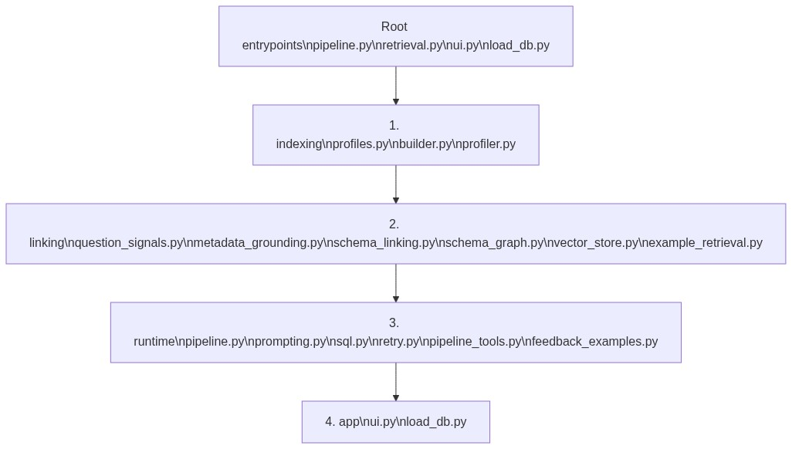

# Beacon Source Layout

Beacon code is organized by pipeline order, not by helper type. Start at the top and move downward when reviewing the system.

## Root Entrypoints

The package root stays intentionally small.

- `pyproject.toml` owns package metadata, dependencies, console scripts, and pytest settings.
- `src/beacon/config.py` owns paths, environment variables, and database settings.
- `src/beacon/pipeline.py` keeps `python -m beacon.pipeline` working and delegates to `beacon.runtime.pipeline`.
- `src/beacon/retrieval.py` keeps old retrieval imports working and delegates to `beacon.linking.retrieval`.
- `src/beacon/retrieval_tools.py` keeps the old fallback-classifier import working and delegates to `beacon.linking.compatibility`.
- `src/beacon/ui.py` and `src/beacon/load_db.py` keep the existing app commands working.

## Layer Responsibilities

`src/beacon/indexing/`

Builds semantic profiles and retrieval artifacts. This layer reads `data/semantic_model/`, `data/processed/`, and `data/few_shot_queries.json`, then writes local vector artifacts under `data/indices/local_vectors/`.

`src/beacon/linking/`

Builds linked schema context for one question. This layer owns question signals, metadata grounding, vector schema search, compatibility fallback signals, join-path expansion, and structural few-shot ranking.

`src/beacon/runtime/`

Runs one question through prompt construction, SQL generation, SQL validation, read-only execution, reviewer-guided retry, and final answer composition.

`src/beacon/app/`

Contains human-facing entrypoints. Keep UI and local database loading details here so the runtime pipeline remains easy to read.

## Review Path

For a pipeline review, read in this order:

1. `src/beacon/runtime/pipeline.py`
2. `src/beacon/linking/retrieval.py`
3. `src/beacon/linking/schema_linking.py`
4. `src/beacon/runtime/prompting.py`
5. `src/beacon/runtime/sql.py`
6. `src/beacon/runtime/retry.py`

For indexing or semantic profile changes, read:

1. `src/beacon/indexing/builder.py`
2. `src/beacon/indexing/profiles.py`
3. `src/beacon/linking/schema_index.py`
4. `src/beacon/linking/vector_store.py`
