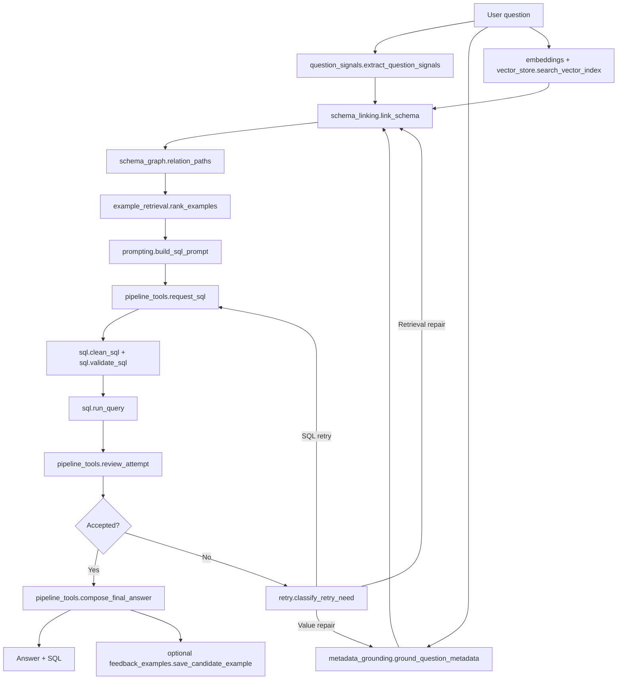

# Metadata Grounding And Schema Linking Implementation Plan

> **For agentic workers:** REQUIRED SUB-SKILL: Use superpowers:subagent-driven-development (recommended) or superpowers:executing-plans to implement this plan task-by-task. Steps use checkbox (`- [ ]`) syntax for tracking.

**Goal:** Replace Beacon's database-specific keyword-first retrieval path with a clean, modular, metadata-grounded, vector-assisted schema linking pipeline that can generalize to Spider 2.0-Snow while keeping the current fallback behavior until the new linker proves better.

**Architecture:** Beacon will use a layered retrieval pipeline: generic question signals, metadata/value grounding, vector schema retrieval, schema graph expansion, structurally ranked examples, prompt assembly, SQL generation, validation, execution, and dynamic retry. Modules should be deep enough to hide implementation detail behind small dictionary-based interfaces, but not framework-heavy.

**Tech Stack:** Python, plain dictionaries/lists, PostgreSQL via psycopg2, local sentence-transformer embeddings, NumPy-backed vector search for v1, optional FAISS adapter later if measured retrieval latency requires it.

---

## Core Decisions

### Vector Store Choice

Use a **NumPy-backed local vector store** for v1, not ChromaDB and not FAISS.

Reasons:

- It is simplest to inspect and test on Windows.
- Spider-Snow retrieval should be per database, so brute-force cosine search over hundreds or thousands of schema records is acceptable for v1.
- It avoids a heavier local database dependency.
- It keeps the interface small: save `records.json`, `vectors.npy`, and `manifest.json`.
- If latency becomes a measured problem, add a FAISS adapter behind the same `vector_store.py` interface.

Runtime embedding adapter:

- Production: `sentence-transformers` with a small local model, default `BAAI/bge-small-en-v1.5`.
- Tests: deterministic `HashEmbeddingAdapter` so tests do not download models.

### Old Keyword Classifier Strategy

Do not make the old keyword classifier Spider-Snow-aware by adding more table-name rules. That would become unmaintainable.

Instead:

- Rename its role from "question needs extractor" to **generic question signal extractor**.
- Remove Beacon e-commerce table assumptions from the main path.
- Keep only reusable signals:
  - aggregation words
  - time grain
  - date-like spans
  - number-like spans
  - superlatives and ranking
  - comparison words
  - grouping words
  - possible entity/value phrases
  - metric nouns
  - filter nouns
- Add weak schema lexical matching from actual semantic model names/descriptions.
- Use its output as one fallback signal in schema linking, not as the source of truth.

### Evidence Confidence

Evidence pinning is no longer absolute. A value only becomes pinned if:

- score is at least `80`,
- top candidate margin is at least `15`,
- candidate type is compatible with the term,
- the term is not obviously ambiguous across multiple columns,
- and at least one strong source supports it: alias, exact top value, exact sample value, or safe value probe.

Ambiguous evidence is still shown to the LLM, but not pinned.

### CoT And Retry

Do not return visible chain-of-thought from SQL generation.

Use this contract:

- SQL generation returns SQL only.
- SQL review returns strict JSON.
- Retry uses:
  - prior SQL,
  - validation errors,
  - execution errors,
  - result summaries,
  - reviewer reason,
  - retrieval repair notes,
  - grounded evidence,
  - and selected schema context.

If an internal plan is useful, store a short **query plan summary**, not raw CoT. The query plan summary can be generated by the reviewer or a small prompt, but it should not be part of the public SQL output.

### Feedback Example Mechanic

Accepted SQL attempts can become candidate examples.

The first version should be semi-automatic:

- save verified query candidates to `data/example_candidates.json`,
- include question, SQL, tables, columns, metrics, filters, time grain, row count, reviewer reason, and timestamp,
- deduplicate by normalized SQL and question fingerprint,
- only promote to `data/few_shot_queries.json` through an explicit command.

---

## Target Module Layout

### Existing Modules To Keep

- `src/beacon/pipeline.py`
  - Keeps public entry points: `answer_question`, `ask_database`, `main`.
  - Delegates retrieval and retry details to focused helper modules.

- `src/beacon/pipeline_tools.py`
  - Keeps LLM calls, result summaries, review JSON parsing, final answer composition.
  - Adds no schema-linking logic.

- `src/beacon/sql.py`
  - Keeps SQL cleanup, validation, execution, formatting.
  - Later can add SQLGlot, but this plan keeps regex validation unless test failures demand parser support.

- `src/beacon/profiler.py`
  - Remains the offline metadata refresh entry point.
  - Should not be merged into runtime grounding.

### New Or Refocused Modules

- `src/beacon/question_signals.py`
  - Generic question understanding.
  - No hardcoded business tables.
  - Output is reusable signals, not final tables.

- `src/beacon/metadata_grounding.py`
  - Online value/entity grounding.
  - Adds confidence scoring, ambiguity status, and pin eligibility.

- `src/beacon/schema_graph.py`
  - Builds table/column relation graph from semantic model.
  - Finds bounded join paths for selected tables.

- `src/beacon/embeddings.py`
  - Hides embedding implementation.
  - Production adapter: sentence-transformers.
  - Test adapter: deterministic hash embeddings.

- `src/beacon/vector_store.py`
  - Saves/loads/searches local vector index.
  - Uses NumPy arrays and JSON records.

- `src/beacon/schema_index.py`
  - Builds schema records for vector indexing.
  - One record per table and one record per column.

- `src/beacon/schema_linking.py`
  - Main retrieval module.
  - Combines question signals, grounding, vector retrieval, lexical fallback, relation expansion, and coverage.

- `src/beacon/example_retrieval.py`
  - Ranks examples by structural metadata, not just question text.
  - Reads both curated examples and promoted feedback examples.

- `src/beacon/feedback_examples.py`
  - Saves accepted query candidates.
  - Promotes reviewed candidates into few-shot examples.

- `src/beacon/retry.py`
  - Decides whether failed attempts need SQL-only retry, value repair, or retrieval repair.
  - Keeps retry policy out of `pipeline.py`.

- `src/beacon/prompting.py`
  - Builds prompt text from linked context.
  - Owns prompt section order and SQL-only contract.

### Docs To Add

- `docs/modules/question_signals.md`
- `docs/modules/metadata_grounding.md`
- `docs/modules/schema_graph.md`
- `docs/modules/vector_store.md`
- `docs/modules/schema_linking.md`
- `docs/modules/example_retrieval.md`
- `docs/modules/feedback_examples.md`
- `docs/modules/retry.md`
- `docs/modules/prompting.md`
- `docs/pipeline.md`

### Docs To Update

- `README.md`
- `docs/pipeline_deep_dive.md`

---

## Plain Dictionary Interfaces

### `question_signals.extract_question_signals(question, semantic_model=None)`

Return:

```python
{
    "terms": ["revenue", "category"],
    "entities": ["Apple Pay"],
    "dates": [{"text": "2020", "kind": "year", "value": 2020}],
    "numbers": [{"text": "3", "value": 3, "role": "limit"}],
    "intents": {"aggregation", "group_by", "top_n"},
    "metrics": {"revenue"},
    "filters": {"date_filter"},
    "time_grain": "month",
    "weak_tables": {"orders": 0.42},
    "weak_columns": {"order_date": 0.38},
    "reasons": [
        "top_n: matched 'top'",
        "metric: matched 'revenue'"
    ],
}
```

### `metadata_grounding.ground_question_metadata(question, semantic_model, settings=None)`

Return:

```python
[
    {
        "term": "apple pay",
        "table": "orders",
        "column": "payment_method",
        "value": "apple_pay",
        "value_sql": "'apple_pay'",
        "source": "alias",
        "score": 95,
        "confidence": "high",
        "status": "pinned",
        "pin": True,
        "reasons": ["alias match", "unique column match"],
    }
]
```

Ambiguous return:

```python
[
    {
        "term": "apple",
        "table": "clients",
        "column": "company_name",
        "value": "Apple",
        "value_sql": "'Apple'",
        "source": "profile",
        "score": 72,
        "confidence": "medium",
        "status": "ambiguous",
        "pin": False,
        "reasons": ["profile value match", "ambiguous with orders.payment_method"],
    }
]
```

### `schema_linking.link_schema(question, semantic_model, settings=None)`

Return:

```python
{
    "question": "What is revenue by category?",
    "signals": {...},
    "evidence": [...],
    "selected_tables": ["orders", "order_items", "products"],
    "selected_columns": [
        {"table": "orders", "column": "order_id", "reason": "join path", "score": 0.71},
        {"table": "order_items", "column": "quantity", "reason": "metric revenue", "score": 0.83},
    ],
    "join_paths": [
        "orders.order_id -> order_items.order_id",
        "order_items.product_id -> products.product_id",
    ],
    "schema_docs": [...],
    "example_docs": [...],
    "coverage": {
        "is_sufficient": True,
        "confidence": "medium",
        "missing": {"tables": [], "columns": [], "relations": []},
        "warnings": [],
    },
}
```

### `retry.classify_retry_need(attempt, known_schema)`

Return:

```python
{
    "action": "sql_retry" | "retrieval_repair" | "value_repair" | "fail",
    "reason": "SQL referenced a known table outside retrieved context.",
    "requested_tables": ["customers"],
    "requested_columns": [],
    "value_terms": [],
}
```

---

## Task 1: Add Configuration For Local Retrieval Artifacts

**Files:**
- Modify: `src/beacon/config.py`
- Modify: `requirements.txt`
- Test: `tests/test_vector_store.py`

- [ ] **Step 1: Write the failing config test**

Create `tests/test_vector_store.py` with:

```python
from beacon import config


def test_local_vector_paths_are_defined_under_data_indices():
    assert config.LOCAL_VECTOR_INDEX_DIR == config.INDEX_DIR / "local_vectors"
    assert config.SCHEMA_VECTOR_RECORDS_PATH == config.LOCAL_VECTOR_INDEX_DIR / "schema_records.json"
    assert config.SCHEMA_VECTOR_MATRIX_PATH == config.LOCAL_VECTOR_INDEX_DIR / "schema_vectors.npy"
    assert config.SCHEMA_VECTOR_MANIFEST_PATH == config.LOCAL_VECTOR_INDEX_DIR / "schema_manifest.json"
```

- [ ] **Step 2: Run the failing test**

Run:

```powershell
$env:PYTHONPATH="src"
pytest tests/test_vector_store.py -v
```

Expected: fail because the new config constants do not exist.

- [ ] **Step 3: Add config constants**

Add to `src/beacon/config.py`:

```python
LOCAL_VECTOR_INDEX_DIR = INDEX_DIR / "local_vectors"
SCHEMA_VECTOR_RECORDS_PATH = LOCAL_VECTOR_INDEX_DIR / "schema_records.json"
SCHEMA_VECTOR_MATRIX_PATH = LOCAL_VECTOR_INDEX_DIR / "schema_vectors.npy"
SCHEMA_VECTOR_MANIFEST_PATH = LOCAL_VECTOR_INDEX_DIR / "schema_manifest.json"
FEEDBACK_EXAMPLES_PATH = DATA_DIR / "example_candidates.json"
```

- [ ] **Step 4: Add dependencies**

Append to `requirements.txt`:

```text
numpy
sentence-transformers
```

- [ ] **Step 5: Run the test**

Run:

```powershell
$env:PYTHONPATH="src"
pytest tests/test_vector_store.py -v
```

Expected: pass.

---

## Task 2: Convert Keyword Classifier Into Generic Question Signals

**Files:**
- Create: `src/beacon/question_signals.py`
- Modify: `src/beacon/retrieval_tools.py`
- Test: `tests/test_question_signals.py`

- [ ] **Step 1: Write signal tests**

Create `tests/test_question_signals.py`:

```python
from beacon.question_signals import extract_question_signals


def test_extract_question_signals_detects_generic_intents():
    signals = extract_question_signals("Show the top 3 cities by revenue in 2020")

    assert "top_n" in signals["intents"]
    assert "group_by" in signals["intents"]
    assert "aggregation" in signals["intents"]
    assert signals["metrics"] == {"revenue"}
    assert signals["time_grain"] == "year"
    assert signals["numbers"][0]["value"] == 3
    assert signals["dates"][0]["value"] == 2020


def test_extract_question_signals_uses_schema_names_as_weak_matches():
    semantic_model = [
        {
            "source_table": "finance_events",
            "semantic_name": "Finance Events",
            "description": "Revenue and cost events.",
            "columns": [
                {"name": "gross_revenue", "description": "Gross revenue amount."},
                {"name": "event_date", "description": "Event date."},
            ],
        }
    ]

    signals = extract_question_signals("What revenue did we get last year?", semantic_model)

    assert signals["weak_tables"]["finance_events"] > 0
    assert signals["weak_columns"]["gross_revenue"] > 0
    assert "revenue" in signals["metrics"]
```

- [ ] **Step 2: Run the failing tests**

Run:

```powershell
$env:PYTHONPATH="src"
pytest tests/test_question_signals.py -v
```

Expected: fail because `question_signals.py` does not exist.

- [ ] **Step 3: Implement `question_signals.py`**

Create `src/beacon/question_signals.py` with these functions:

```python
"""Generic question signal extraction for schema linking."""

from __future__ import annotations

import re


STOPWORDS = {"a", "an", "and", "are", "by", "for", "from", "how", "in", "is", "of", "on", "or", "the", "to", "what", "which", "with"}
INTENT_PHRASES = {
    "aggregation": {"total", "sum", "average", "avg", "count", "how many", "revenue", "sales"},
    "group_by": {"by", "per", "each", "breakdown"},
    "top_n": {"top", "most", "highest", "largest", "best"},
    "bottom_n": {"bottom", "least", "lowest", "smallest", "worst"},
    "comparison": {"compare", "versus", "vs", "difference", "more than", "less than"},
}
METRIC_PHRASES = {
    "revenue": {"revenue", "sales", "gross sales"},
    "cost": {"cost", "cogs", "expense"},
    "count": {"count", "how many", "number of"},
    "average": {"average", "avg", "mean"},
}
TIME_GRAIN_PHRASES = [
    ("day", {"daily", "by day", "per day", "each day"}),
    ("month", {"monthly", "by month", "per month", "month"}),
    ("quarter", {"quarterly", "quarter"}),
    ("year", {"yearly", "by year", "per year", "year", "last year", "this year"}),
]


def extract_question_signals(question: str, semantic_model: list[dict] | None = None) -> dict:
    text = normalize(question)
    terms = question_terms(text)
    intents = {label for label, phrases in INTENT_PHRASES.items() if has_any(text, phrases)}
    metrics = {label for label, phrases in METRIC_PHRASES.items() if has_any(text, phrases)}
    dates = extract_dates(text)
    numbers = extract_numbers(text)
    time_grain = first_time_grain(text, dates)
    entities = extract_entity_phrases(question)
    weak_tables, weak_columns = weak_schema_matches(text, semantic_model or [])
    reasons = sorted(
        [f"intent:{item}" for item in intents]
        + [f"metric:{item}" for item in metrics]
        + ([f"time_grain:{time_grain}"] if time_grain else [])
    )
    return {
        "terms": sorted(terms),
        "entities": entities,
        "dates": dates,
        "numbers": numbers,
        "intents": intents,
        "metrics": metrics,
        "filters": {"date_filter"} if dates or time_grain else set(),
        "time_grain": time_grain,
        "weak_tables": weak_tables,
        "weak_columns": weak_columns,
        "reasons": reasons,
    }


def normalize(value: str) -> str:
    return " ".join(value.lower().replace("_", " ").replace("-", " ").split())


def has_any(text: str, phrases: set[str]) -> bool:
    return any(re.search(rf"(?<!\w){re.escape(phrase)}(?!\w)", text) for phrase in phrases)


def question_terms(text: str) -> set[str]:
    return {term for term in re.findall(r"[a-z][a-z0-9]*", text) if term not in STOPWORDS and len(term) > 1}


def extract_dates(text: str) -> list[dict]:
    return [{"text": match.group(0), "kind": "year", "value": int(match.group(0))} for match in re.finditer(r"\b(?:19|20)\d{2}\b", text)]


def extract_numbers(text: str) -> list[dict]:
    numbers = []
    for match in re.finditer(r"\b\d+(?:\.\d+)?\b", text):
        raw = match.group(0)
        if re.fullmatch(r"(?:19|20)\d{2}", raw):
            continue
        value = float(raw) if "." in raw else int(raw)
        before = text[max(0, match.start() - 10):match.start()]
        role = "limit" if "top" in before or "bottom" in before else "number"
        numbers.append({"text": raw, "value": value, "role": role})
    return numbers


def first_time_grain(text: str, dates: list[dict]) -> str | None:
    for label, phrases in TIME_GRAIN_PHRASES:
        if has_any(text, phrases):
            return label
    return "year" if dates else None


def extract_entity_phrases(question: str) -> list[str]:
    return sorted(set(re.findall(r"\b[A-Z][A-Za-z0-9]+(?:\s+[A-Z][A-Za-z0-9]+)*\b", question)))


def weak_schema_matches(text: str, semantic_model: list[dict]) -> tuple[dict, dict]:
    tables: dict[str, float] = {}
    columns: dict[str, float] = {}
    terms = question_terms(text)
    for table in semantic_model:
        table_name = table.get("source_table", "")
        table_text = normalize(" ".join([table_name, table.get("semantic_name", ""), table.get("description", "")]))
        overlap = terms & question_terms(table_text)
        if overlap:
            tables[table_name] = round(min(0.2 + 0.1 * len(overlap), 0.7), 2)
        for column in table.get("columns", []):
            column_name = column.get("name", "")
            column_text = normalize(" ".join([column_name, column.get("description", "")]))
            column_overlap = terms & question_terms(column_text)
            if column_overlap:
                columns[column_name] = round(min(0.2 + 0.1 * len(column_overlap), 0.7), 2)
    return tables, columns
```

- [ ] **Step 4: Keep old classifier as compatibility wrapper**

Modify `src/beacon/retrieval_tools.py` so `extract_question_needs()` remains available for old tests, but new runtime callers should use `question_signals.extract_question_signals()`.

Do not delete `extract_question_needs()` in this task.

- [ ] **Step 5: Run tests**

Run:

```powershell
$env:PYTHONPATH="src"
pytest tests/test_question_signals.py tests/test_core_pipeline.py -v
```

Expected: pass.

---

## Task 3: Add Schema Graph Expansion

**Files:**
- Create: `src/beacon/schema_graph.py`
- Test: `tests/test_schema_graph.py`

- [ ] **Step 1: Write graph tests**

Create `tests/test_schema_graph.py`:

```python
from beacon.schema_graph import build_schema_graph, relation_paths


SEMANTIC_MODEL = [
    {
        "source_table": "customers",
        "columns": [{"name": "customer_id"}, {"name": "zip"}],
        "relations": [{"from": "customers.customer_id", "to": "orders.customer_id"}],
    },
    {
        "source_table": "orders",
        "columns": [{"name": "order_id"}, {"name": "customer_id"}],
        "relations": [{"from": "orders.order_id", "to": "order_items.order_id"}],
    },
    {
        "source_table": "order_items",
        "columns": [{"name": "order_id"}, {"name": "product_id"}],
        "relations": [{"from": "order_items.product_id", "to": "products.product_id"}],
    },
    {"source_table": "products", "columns": [{"name": "product_id"}], "relations": []},
]


def test_relation_paths_connect_selected_tables_with_bridge_tables():
    graph = build_schema_graph(SEMANTIC_MODEL)
    paths = relation_paths(graph, {"customers", "products"}, max_hops=3)

    assert "customers.customer_id -> orders.customer_id" in paths
    assert "orders.order_id -> order_items.order_id" in paths
    assert "order_items.product_id -> products.product_id" in paths
```

- [ ] **Step 2: Run failing tests**

Run:

```powershell
$env:PYTHONPATH="src"
pytest tests/test_schema_graph.py -v
```

Expected: fail because `schema_graph.py` does not exist.

- [ ] **Step 3: Implement `schema_graph.py`**

Create functions:

```python
"""Schema relation graph helpers."""

from __future__ import annotations

from collections import deque


def build_schema_graph(semantic_model: list[dict]) -> dict:
    tables = {table["source_table"]: table for table in semantic_model}
    edges: dict[str, list[dict]] = {name: [] for name in tables}
    for table in semantic_model:
        for relation in table.get("relations", []):
            left = relation["from"]
            right = relation["to"]
            left_table = left.split(".", 1)[0]
            right_table = right.split(".", 1)[0]
            text = f"{left} -> {right}"
            edges.setdefault(left_table, []).append({"to": right_table, "relation": text})
            edges.setdefault(right_table, []).append({"to": left_table, "relation": text})
    return {"tables": tables, "edges": edges}


def relation_paths(graph: dict, selected_tables: set[str], max_hops: int = 2) -> list[str]:
    relations: list[str] = []
    seen: set[str] = set()
    ordered = sorted(selected_tables)
    for index, start in enumerate(ordered):
        for end in ordered[index + 1:]:
            for relation in shortest_relation_path(graph, start, end, max_hops):
                if relation not in seen:
                    seen.add(relation)
                    relations.append(relation)
    return relations


def shortest_relation_path(graph: dict, start: str, end: str, max_hops: int) -> list[str]:
    if start == end:
        return []
    queue = deque([(start, [])])
    visited = {start}
    while queue:
        table, path = queue.popleft()
        if len(path) >= max_hops:
            continue
        for edge in graph.get("edges", {}).get(table, []):
            next_table = edge["to"]
            next_path = path + [edge["relation"]]
            if next_table == end:
                return next_path
            if next_table not in visited:
                visited.add(next_table)
                queue.append((next_table, next_path))
    return []
```

- [ ] **Step 4: Run tests**

Run:

```powershell
$env:PYTHONPATH="src"
pytest tests/test_schema_graph.py -v
```

Expected: pass.

---

## Task 4: Add Local Embeddings And NumPy Vector Store

**Files:**
- Create: `src/beacon/embeddings.py`
- Create: `src/beacon/vector_store.py`
- Test: `tests/test_vector_store.py`

- [ ] **Step 1: Extend vector store tests**

Append to `tests/test_vector_store.py`:

```python
from pathlib import Path

from beacon.embeddings import HashEmbeddingAdapter
from beacon.vector_store import save_vector_index, load_vector_index, search_vector_index


def test_numpy_vector_store_round_trips_and_searches(tmp_path: Path):
    records = [
        {"id": "orders.order_id", "text": "orders order id primary key", "metadata": {"table": "orders", "column": "order_id"}},
        {"id": "products.category", "text": "products category clothing segment", "metadata": {"table": "products", "column": "category"}},
    ]
    embedder = HashEmbeddingAdapter(dimensions=16)
    vectors = embedder.embed_texts([record["text"] for record in records])

    save_vector_index(tmp_path, records, vectors, {"model": "hash-test"})
    loaded = load_vector_index(tmp_path)
    results = search_vector_index(loaded, embedder.embed_text("clothing category"), top_k=1)

    assert results[0]["record"]["id"] == "products.category"
    assert results[0]["score"] > 0
```

- [ ] **Step 2: Run failing tests**

Run:

```powershell
$env:PYTHONPATH="src"
pytest tests/test_vector_store.py -v
```

Expected: fail because modules do not exist.

- [ ] **Step 3: Implement `embeddings.py`**

Create `src/beacon/embeddings.py`:

```python
"""Small embedding adapters used by Beacon retrieval."""

from __future__ import annotations

import hashlib
import math
import os
import re

import numpy as np


DEFAULT_EMBEDDING_MODEL = "BAAI/bge-small-en-v1.5"


class HashEmbeddingAdapter:
    """Deterministic local embeddings for tests and offline smoke checks."""

    def __init__(self, dimensions: int = 128):
        self.dimensions = dimensions

    def embed_text(self, text: str) -> np.ndarray:
        return self.embed_texts([text])[0]

    def embed_texts(self, texts: list[str]) -> np.ndarray:
        rows = []
        for text in texts:
            vector = np.zeros(self.dimensions, dtype="float32")
            for token in re.findall(r"[a-zA-Z0-9_]+", text.lower()):
                digest = hashlib.md5(token.encode("utf-8")).hexdigest()
                index = int(digest[:8], 16) % self.dimensions
                vector[index] += 1.0
            norm = float(np.linalg.norm(vector)) or 1.0
            rows.append(vector / norm)
        return np.vstack(rows)


class SentenceTransformerEmbeddingAdapter:
    """Production local embedding adapter backed by sentence-transformers."""

    def __init__(self, model_name: str | None = None):
        from sentence_transformers import SentenceTransformer

        self.model_name = model_name or os.getenv("BEACON_EMBEDDING_MODEL", DEFAULT_EMBEDDING_MODEL)
        self.model = SentenceTransformer(self.model_name)

    def embed_text(self, text: str) -> np.ndarray:
        return self.embed_texts([text])[0]

    def embed_texts(self, texts: list[str]) -> np.ndarray:
        vectors = self.model.encode(texts, normalize_embeddings=True)
        return np.asarray(vectors, dtype="float32")
```

- [ ] **Step 4: Implement `vector_store.py`**

Create `src/beacon/vector_store.py`:

```python
"""Tiny NumPy-backed vector store for local schema retrieval."""

from __future__ import annotations

import json
from pathlib import Path

import numpy as np


def save_vector_index(index_dir: Path, records: list[dict], vectors, manifest: dict) -> None:
    index_dir.mkdir(parents=True, exist_ok=True)
    matrix = np.asarray(vectors, dtype="float32")
    with (index_dir / "schema_records.json").open("w", encoding="utf-8") as handle:
        json.dump(records, handle, ensure_ascii=False, indent=2)
        handle.write("\n")
    with (index_dir / "schema_manifest.json").open("w", encoding="utf-8") as handle:
        json.dump({**manifest, "record_count": len(records), "dimensions": int(matrix.shape[1])}, handle, ensure_ascii=False, indent=2)
        handle.write("\n")
    np.save(index_dir / "schema_vectors.npy", matrix)


def load_vector_index(index_dir: Path) -> dict:
    with (index_dir / "schema_records.json").open(encoding="utf-8") as handle:
        records = json.load(handle)
    with (index_dir / "schema_manifest.json").open(encoding="utf-8") as handle:
        manifest = json.load(handle)
    vectors = np.load(index_dir / "schema_vectors.npy")
    return {"records": records, "vectors": vectors, "manifest": manifest}


def search_vector_index(index: dict, query_vector, top_k: int = 10) -> list[dict]:
    vectors = index["vectors"]
    query = np.asarray(query_vector, dtype="float32")
    query_norm = float(np.linalg.norm(query)) or 1.0
    scores = vectors @ (query / query_norm)
    order = np.argsort(-scores)[:top_k]
    return [
        {"record": index["records"][int(i)], "score": float(scores[int(i)])}
        for i in order
    ]
```

- [ ] **Step 5: Run tests**

Run:

```powershell
$env:PYTHONPATH="src"
pytest tests/test_vector_store.py -v
```

Expected: pass.

---

## Task 5: Build Schema Vector Records During Indexing

**Files:**
- Create: `src/beacon/schema_index.py`
- Modify: `src/beacon/indexing.py`
- Test: `tests/test_schema_index.py`

- [ ] **Step 1: Write schema index tests**

Create `tests/test_schema_index.py`:

```python
from beacon.schema_index import build_schema_records


def test_build_schema_records_creates_table_and_column_records():
    semantic_model = [
        {
            "source_table": "orders",
            "semantic_name": "Orders",
            "grain": "one row per order",
            "description": "Customer order records.",
            "columns": [
                {
                    "name": "payment_method",
                    "type": "TEXT",
                    "description": "How the customer paid.",
                    "profile": {"sample_values": ["apple_pay"], "top_values": [{"value": "cod", "count": 3}]},
                }
            ],
        }
    ]

    records = build_schema_records(semantic_model)

    assert [record["kind"] for record in records] == ["table", "column"]
    assert records[0]["id"] == "orders"
    assert records[1]["id"] == "orders.payment_method"
    assert "apple_pay" in records[1]["text"]
    assert records[1]["metadata"]["table"] == "orders"
```

- [ ] **Step 2: Run failing test**

Run:

```powershell
$env:PYTHONPATH="src"
pytest tests/test_schema_index.py -v
```

Expected: fail because `schema_index.py` does not exist.

- [ ] **Step 3: Implement `schema_index.py`**

Create `src/beacon/schema_index.py` with:

```python
"""Build vector-searchable schema records from semantic metadata."""

from __future__ import annotations


def build_schema_records(semantic_model: list[dict]) -> list[dict]:
    records: list[dict] = []
    for table in semantic_model:
        table_name = table["source_table"]
        records.append(
            {
                "id": table_name,
                "kind": "table",
                "text": " ".join(
                    str(part)
                    for part in [
                        table_name,
                        table.get("semantic_name", ""),
                        table.get("grain", ""),
                        table.get("description", ""),
                        " ".join(table.get("question_families", [])),
                    ]
                    if part
                ),
                "metadata": {"table": table_name, "column": None},
            }
        )
        for column in table.get("columns", []):
            records.append(column_record(table_name, column))
    return records


def column_record(table_name: str, column: dict) -> dict:
    profile = column.get("profile", {})
    profile_values = []
    profile_values.extend(map(str, profile.get("sample_values", [])))
    profile_values.extend(str(item.get("value")) for item in profile.get("top_values", []))
    profile_values.extend(profile.get("value_counts", {}).keys())
    text = " ".join(
        str(part)
        for part in [
            table_name,
            column.get("name", ""),
            column.get("type", ""),
            column.get("description", ""),
            " ".join(profile_values),
        ]
        if part
    )
    return {
        "id": f"{table_name}.{column['name']}",
        "kind": "column",
        "text": text,
        "metadata": {"table": table_name, "column": column["name"]},
    }
```

- [ ] **Step 4: Modify indexing to build local vectors**

In `src/beacon/indexing.py`, import:

```python
from beacon.config import LOCAL_VECTOR_INDEX_DIR
from beacon.embeddings import SentenceTransformerEmbeddingAdapter
from beacon.schema_index import build_schema_records
from beacon.vector_store import save_vector_index
```

Inside `build_indices()` after semantic model enrichment:

```python
schema_records = build_schema_records(semantic_model)
embedder = SentenceTransformerEmbeddingAdapter()
schema_vectors = embedder.embed_texts([record["text"] for record in schema_records])
save_vector_index(
    LOCAL_VECTOR_INDEX_DIR,
    schema_records,
    schema_vectors,
    {"model": embedder.model_name, "kind": "schema"},
)
```

- [ ] **Step 5: Run tests**

Run:

```powershell
$env:PYTHONPATH="src"
pytest tests/test_schema_index.py tests/test_vector_store.py -v
```

Expected: pass.

---

## Task 6: Add Evidence Confidence And Ambiguity Handling

**Files:**
- Modify: `src/beacon/metadata_grounding.py`
- Test: `tests/test_metadata_grounding.py`

- [ ] **Step 1: Add confidence tests**

Append to `tests/test_metadata_grounding.py`:

```python
from beacon.metadata_grounding import score_grounding_candidates


def test_score_grounding_candidates_pins_only_clear_high_confidence_matches():
    candidates = [
        {"term": "apple pay", "table": "orders", "column": "payment_method", "value": "apple_pay", "source": "alias", "score": 100},
    ]

    scored = score_grounding_candidates(candidates)

    assert scored[0]["confidence"] == "high"
    assert scored[0]["status"] == "pinned"
    assert scored[0]["pin"] is True


def test_score_grounding_candidates_marks_close_matches_ambiguous():
    candidates = [
        {"term": "apple", "table": "clients", "column": "company_name", "value": "Apple", "source": "profile", "score": 80},
        {"term": "apple", "table": "orders", "column": "payment_method", "value": "apple_pay", "source": "profile", "score": 73},
    ]

    scored = score_grounding_candidates(candidates)

    assert {item["status"] for item in scored} == {"ambiguous"}
    assert not any(item["pin"] for item in scored)
```

- [ ] **Step 2: Run failing tests**

Run:

```powershell
$env:PYTHONPATH="src"
pytest tests/test_metadata_grounding.py -v
```

Expected: fail because `score_grounding_candidates()` does not exist.

- [ ] **Step 3: Implement scoring**

Add to `src/beacon/metadata_grounding.py`:

```python
def score_grounding_candidates(candidates: list[dict]) -> list[dict]:
    """Add confidence and pin status to raw grounding candidates."""
    grouped: dict[str, list[dict]] = {}
    for item in candidates:
        grouped.setdefault(item["term"], []).append(dict(item))

    scored: list[dict] = []
    for term, items in grouped.items():
        ordered = sorted(items, key=lambda item: -int(item.get("score", 0)))
        top_score = int(ordered[0].get("score", 0))
        second_score = int(ordered[1].get("score", 0)) if len(ordered) > 1 else 0
        margin = top_score - second_score
        ambiguous = len(ordered) > 1 and margin < 15
        for item in ordered:
            score = int(item.get("score", 0))
            confidence = "high" if score >= 85 else "medium" if score >= 65 else "low"
            pin = bool(score >= 80 and margin >= 15 and not ambiguous)
            item["confidence"] = confidence
            item["status"] = "ambiguous" if ambiguous else "pinned" if pin else "candidate"
            item["pin"] = pin
            item["reasons"] = grounding_reasons(item, margin, ambiguous)
            scored.append(item)
    return scored


def grounding_reasons(item: dict, margin: int, ambiguous: bool) -> list[str]:
    reasons = [f"source:{item.get('source', 'unknown')}", f"score:{item.get('score', 0)}"]
    if ambiguous:
        reasons.append("ambiguous term")
    else:
        reasons.append(f"margin:{margin}")
    return reasons
```

Modify `ground_question_metadata()` so it builds raw candidates and returns:

```python
return score_grounding_candidates(evidence)
```

- [ ] **Step 4: Update `apply_grounding_to_needs()`**

Change it so only pinned evidence is allowed to force schema:

```python
for item in evidence:
    if item.get("pin", True):
        grounded["tables"].add(item["table"])
        grounded["columns"].add(item["column"])
```

The `item.get("pin", True)` fallback preserves compatibility with older tests.

- [ ] **Step 5: Run tests**

Run:

```powershell
$env:PYTHONPATH="src"
pytest tests/test_metadata_grounding.py -v
```

Expected: pass.

---

## Task 7: Build The New Schema Linking Module

**Files:**
- Create: `src/beacon/schema_linking.py`
- Modify: `src/beacon/retrieval.py`
- Test: `tests/test_schema_linking.py`

- [ ] **Step 1: Write linker tests**

Create `tests/test_schema_linking.py`:

```python
from beacon.embeddings import HashEmbeddingAdapter
from beacon.schema_index import build_schema_records
from beacon.schema_linking import link_schema
from beacon.vector_store import save_vector_index


SEMANTIC_MODEL = [
    {
        "source_table": "orders",
        "semantic_name": "Orders",
        "grain": "one row per order",
        "description": "Customer orders and payment methods.",
        "columns": [
            {"name": "order_id", "type": "INTEGER", "description": "Order id.", "profile": {}},
            {"name": "payment_method", "type": "TEXT", "description": "Payment method.", "profile": {"sample_values": ["apple_pay"]}},
        ],
        "relations": [{"from": "orders.order_id", "to": "order_items.order_id"}],
    },
    {
        "source_table": "order_items",
        "semantic_name": "Order Items",
        "grain": "one row per line item",
        "description": "Products purchased in orders.",
        "columns": [
            {"name": "order_id", "type": "INTEGER", "description": "Order id.", "profile": {}},
            {"name": "quantity", "type": "INTEGER", "description": "Quantity purchased.", "profile": {}},
        ],
        "relations": [],
    },
]


def test_link_schema_combines_grounding_vector_and_join_paths(tmp_path):
    embedder = HashEmbeddingAdapter(dimensions=32)
    records = build_schema_records(SEMANTIC_MODEL)
    vectors = embedder.embed_texts([record["text"] for record in records])
    save_vector_index(tmp_path, records, vectors, {"model": "hash-test"})

    context = link_schema(
        "How many Apple Pay purchases?",
        SEMANTIC_MODEL,
        vector_index_dir=tmp_path,
        embedder=embedder,
    )

    assert "orders" in context["selected_tables"]
    assert "payment_method" in {item["column"] for item in context["selected_columns"]}
    assert context["coverage"]["is_sufficient"] is True
    assert context["evidence"][0]["term"] == "apple pay"
```

- [ ] **Step 2: Run failing test**

Run:

```powershell
$env:PYTHONPATH="src"
pytest tests/test_schema_linking.py -v
```

Expected: fail because `schema_linking.py` does not exist.

- [ ] **Step 3: Implement `schema_linking.py`**

Create `src/beacon/schema_linking.py` with a small orchestration interface:

```python
"""Hybrid metadata-grounded schema linking."""

from __future__ import annotations

from beacon.config import LOCAL_VECTOR_INDEX_DIR
from beacon.embeddings import SentenceTransformerEmbeddingAdapter
from beacon.indexing_tools import build_schema_docs
from beacon.metadata_grounding import ground_question_metadata
from beacon.question_signals import extract_question_signals
from beacon.schema_graph import build_schema_graph, relation_paths
from beacon.vector_store import load_vector_index, search_vector_index


def link_schema(
    question: str,
    semantic_model: list[dict],
    vector_index_dir=LOCAL_VECTOR_INDEX_DIR,
    embedder=None,
    top_k: int = 12,
) -> dict:
    signals = extract_question_signals(question, semantic_model)
    evidence = ground_question_metadata(question, semantic_model)
    embedder = embedder or SentenceTransformerEmbeddingAdapter()
    index = load_vector_index(vector_index_dir)
    vector_hits = search_vector_index(index, embedder.embed_text(question), top_k=top_k)

    selected_tables: set[str] = set()
    selected_columns: list[dict] = []

    for item in evidence:
        if item.get("pin"):
            selected_tables.add(item["table"])
            selected_columns.append({"table": item["table"], "column": item["column"], "reason": "pinned evidence", "score": item["score"]})

    for table, score in signals.get("weak_tables", {}).items():
        if score >= 0.3:
            selected_tables.add(table)

    for hit in vector_hits:
        metadata = hit["record"]["metadata"]
        table = metadata.get("table")
        column = metadata.get("column")
        if table:
            selected_tables.add(table)
        if table and column:
            selected_columns.append({"table": table, "column": column, "reason": "vector", "score": hit["score"]})

    graph = build_schema_graph(semantic_model)
    joins = relation_paths(graph, selected_tables, max_hops=3)
    for relation in joins:
        left, right = relation.split(" -> ")
        for ref in (left, right):
            table, column = ref.split(".", 1)
            selected_tables.add(table)
            selected_columns.append({"table": table, "column": column, "reason": "join path", "score": 1.0})

    schema_docs = docs_for_tables(build_schema_docs(semantic_model), selected_tables)
    coverage = assess_linked_coverage(selected_tables, selected_columns, joins)
    return {
        "question": question,
        "signals": signals,
        "evidence": evidence,
        "selected_tables": sorted(selected_tables),
        "selected_columns": dedupe_columns(selected_columns),
        "join_paths": joins,
        "schema_docs": schema_docs,
        "example_docs": [],
        "coverage": coverage,
    }


def docs_for_tables(schema_docs: list[dict], tables: set[str]) -> list[dict]:
    return [doc for doc in schema_docs if doc.get("metadata", {}).get("table") in tables]


def dedupe_columns(columns: list[dict]) -> list[dict]:
    seen = set()
    output = []
    for item in sorted(columns, key=lambda value: (-float(value.get("score", 0)), value["table"], value["column"])):
        key = (item["table"], item["column"])
        if key in seen:
            continue
        seen.add(key)
        output.append(item)
    return output


def assess_linked_coverage(tables: set[str], columns: list[dict], joins: list[str]) -> dict:
    warnings = []
    if not tables:
        warnings.append("No schema tables selected.")
    confidence = "high" if tables and columns else "medium" if tables else "low"
    return {
        "is_sufficient": bool(tables),
        "confidence": confidence,
        "missing": {"tables": [], "columns": [], "relations": []},
        "warnings": warnings,
    }
```

- [ ] **Step 4: Adapt `retrieval.retrieve_context()`**

Modify `src/beacon/retrieval.py` so it calls `link_schema()` first.

The compatibility output shape should stay:

```python
return {
    "question_needs": {
        "tables": set(linked["selected_tables"]),
        "columns": {item["column"] for item in linked["selected_columns"]},
        "relations": set(linked["join_paths"]),
        "example_patterns": linked["signals"].get("intents", set()),
    },
    "schema_docs": linked["schema_docs"],
    "example_docs": linked["example_docs"],
    "schema_coverage": linked["coverage"],
    "matched_evidence": linked["evidence"],
    "linked_context": linked,
}
```

Keep the old retrieval helpers in the file until tests are migrated.

- [ ] **Step 5: Run tests**

Run:

```powershell
$env:PYTHONPATH="src"
pytest tests/test_schema_linking.py tests/test_metadata_grounding.py tests/test_core_pipeline.py -v
```

Expected: pass.

---

## Task 8: Add Structural Example Retrieval

**Files:**
- Create: `src/beacon/example_retrieval.py`
- Modify: `src/beacon/schema_linking.py`
- Test: `tests/test_example_retrieval.py`

- [ ] **Step 1: Write example retrieval tests**

Create `tests/test_example_retrieval.py`:

```python
from beacon.example_retrieval import rank_examples


def test_rank_examples_prefers_structural_overlap():
    examples = [
        {"question": "Count orders", "sql": "SELECT COUNT(*) FROM orders", "tables": ["orders"], "pattern": "count", "metrics": ["count"], "filters": [], "time_grain": None},
        {"question": "Revenue by category", "sql": "SELECT category, SUM(revenue) FROM x", "tables": ["orders", "products"], "pattern": "group_by", "metrics": ["revenue"], "filters": ["date_filter"], "time_grain": "year"},
    ]
    linked_context = {
        "selected_tables": ["orders", "products"],
        "signals": {"metrics": {"revenue"}, "filters": {"date_filter"}, "time_grain": "year", "intents": {"group_by"}},
    }

    ranked = rank_examples("Show revenue by category in 2020", examples, linked_context, limit=1)

    assert ranked[0]["question"] == "Revenue by category"
```

- [ ] **Step 2: Run failing test**

Run:

```powershell
$env:PYTHONPATH="src"
pytest tests/test_example_retrieval.py -v
```

Expected: fail because `example_retrieval.py` does not exist.

- [ ] **Step 3: Implement `example_retrieval.py`**

Create `src/beacon/example_retrieval.py`:

```python
"""Structural few-shot example retrieval."""

from __future__ import annotations


def rank_examples(question: str, examples: list[dict], linked_context: dict, limit: int = 2) -> list[dict]:
    scored = [(score_example(example, linked_context), index, example) for index, example in enumerate(examples)]
    return [example for score, _index, example in sorted(scored, key=lambda item: (-item[0], item[1])) if score > 0][:limit]


def score_example(example: dict, linked_context: dict) -> int:
    signals = linked_context.get("signals", {})
    selected_tables = set(linked_context.get("selected_tables", []))
    score = 0
    score += 5 * len(selected_tables & set(example.get("tables", [])))
    score += 4 * len(set(signals.get("metrics", set())) & set(example.get("metrics", [])))
    score += 3 * len(set(signals.get("filters", set())) & set(example.get("filters", [])))
    if signals.get("time_grain") and signals.get("time_grain") == example.get("time_grain"):
        score += 3
    if example.get("pattern") in signals.get("intents", set()):
        score += 2
    return score
```

- [ ] **Step 4: Integrate into `schema_linking.py`**

Add optional `few_shot_examples` parameter to `link_schema()`.

After `linked` fields are computed:

```python
from beacon.example_retrieval import rank_examples

example_docs = rank_examples(question, few_shot_examples or [], linked_context, limit=2)
```

For compatibility, if using enriched example docs instead of raw examples, pass through their metadata and text unchanged.

- [ ] **Step 5: Run tests**

Run:

```powershell
$env:PYTHONPATH="src"
pytest tests/test_example_retrieval.py tests/test_schema_linking.py -v
```

Expected: pass.

---

## Task 9: Add Semi-Automatic Feedback Examples

**Files:**
- Create: `src/beacon/feedback_examples.py`
- Modify: `src/beacon/pipeline.py`
- Test: `tests/test_feedback_examples.py`

- [ ] **Step 1: Write feedback tests**

Create `tests/test_feedback_examples.py`:

```python
import json

from beacon.feedback_examples import candidate_from_attempt, save_candidate_example


def test_candidate_from_attempt_extracts_reviewed_query_metadata():
    attempt = {"sql": "SELECT COUNT(*) AS order_count FROM orders", "review_reason": "Correct count.", "status": "completed"}
    result = {"columns": ["order_count"], "rows": [[3]], "total": 1}
    linked_context = {"selected_tables": ["orders"], "signals": {"metrics": {"count"}, "filters": set(), "time_grain": None}}

    candidate = candidate_from_attempt("How many orders?", attempt, result, linked_context)

    assert candidate["question"] == "How many orders?"
    assert candidate["tables"] == ["orders"]
    assert candidate["metrics"] == ["count"]
    assert candidate["status"] == "candidate"


def test_save_candidate_example_deduplicates(tmp_path):
    path = tmp_path / "example_candidates.json"
    candidate = {"fingerprint": "abc", "question": "Q", "sql": "SELECT 1", "status": "candidate"}

    save_candidate_example(path, candidate)
    save_candidate_example(path, candidate)

    rows = json.loads(path.read_text(encoding="utf-8"))
    assert rows == [candidate]
```

- [ ] **Step 2: Run failing tests**

Run:

```powershell
$env:PYTHONPATH="src"
pytest tests/test_feedback_examples.py -v
```

Expected: fail because module does not exist.

- [ ] **Step 3: Implement `feedback_examples.py`**

Create `src/beacon/feedback_examples.py`:

```python
"""Save verified SQL attempts as future example candidates."""

from __future__ import annotations

import hashlib
import json
from datetime import datetime, timezone
from pathlib import Path


def candidate_from_attempt(question: str, attempt: dict, result: dict | None, linked_context: dict) -> dict:
    signals = linked_context.get("signals", {})
    sql = attempt.get("sql") or ""
    fingerprint = hashlib.sha256(f"{normalize(question)}\n{normalize(sql)}".encode("utf-8")).hexdigest()[:16]
    return {
        "fingerprint": fingerprint,
        "status": "candidate",
        "question": question,
        "sql": sql,
        "tables": sorted(linked_context.get("selected_tables", [])),
        "metrics": sorted(signals.get("metrics", set())),
        "filters": sorted(signals.get("filters", set())),
        "time_grain": signals.get("time_grain"),
        "row_count": None if result is None else result.get("total"),
        "review_reason": attempt.get("review_reason"),
        "created_at": datetime.now(timezone.utc).isoformat(),
    }


def save_candidate_example(path: Path, candidate: dict) -> None:
    rows = []
    if path.exists():
        rows = json.loads(path.read_text(encoding="utf-8"))
    by_fingerprint = {row["fingerprint"]: row for row in rows}
    by_fingerprint[candidate["fingerprint"]] = candidate
    path.parent.mkdir(parents=True, exist_ok=True)
    path.write_text(json.dumps(list(by_fingerprint.values()), ensure_ascii=False, indent=2) + "\n", encoding="utf-8")


def normalize(value: str) -> str:
    return " ".join(value.lower().split())
```

- [ ] **Step 4: Integrate after accepted attempts**

In `pipeline.answer_section()`, when an attempt is satisfied and `context.get("linked_context")` exists, call:

```python
from beacon.config import FEEDBACK_EXAMPLES_PATH
from beacon.feedback_examples import candidate_from_attempt, save_candidate_example

candidate = candidate_from_attempt(question, attempt, result, context["linked_context"])
save_candidate_example(FEEDBACK_EXAMPLES_PATH, candidate)
```

Keep this behind an env flag to avoid surprising writes:

```python
if os.getenv("BEACON_SAVE_EXAMPLE_CANDIDATES") == "1":
    ...
```

- [ ] **Step 5: Run tests**

Run:

```powershell
$env:PYTHONPATH="src"
pytest tests/test_feedback_examples.py tests/test_retry_pipeline.py -v
```

Expected: pass.

---

## Task 10: Add Dynamic Retry Classification And Retrieval Repair

**Files:**
- Create: `src/beacon/retry.py`
- Modify: `src/beacon/pipeline.py`
- Test: `tests/test_dynamic_retry.py`

- [ ] **Step 1: Write retry classifier tests**

Create `tests/test_dynamic_retry.py`:

```python
from beacon.retry import classify_retry_need, repair_linked_context


def test_classify_retry_need_requests_retrieval_repair_for_known_table_outside_context():
    attempt = {"status": "validation_error", "error": "SQL references tables outside retrieved context: customers"}
    known_schema = {"tables": {"orders", "customers"}, "selected_tables": {"orders"}}

    decision = classify_retry_need(attempt, known_schema)

    assert decision["action"] == "retrieval_repair"
    assert decision["requested_tables"] == ["customers"]


def test_classify_retry_need_requests_value_repair_for_empty_string_filter_result():
    attempt = {"status": "completed", "sql": "SELECT * FROM orders WHERE payment_method = 'apple pay'", "review_reason": "No rows returned."}
    known_schema = {"tables": {"orders"}, "selected_tables": {"orders"}}

    decision = classify_retry_need(attempt, known_schema)

    assert decision["action"] == "value_repair"
    assert decision["value_terms"] == ["apple pay"]


def test_repair_linked_context_adds_requested_known_table_schema_doc():
    context = {"selected_tables": ["orders"], "schema_docs": [], "join_paths": []}
    decision = {"action": "retrieval_repair", "requested_tables": ["customers"], "requested_columns": [], "value_terms": []}
    semantic_model = [
        {"source_table": "orders", "semantic_name": "Orders", "grain": "one row per order", "description": "Orders.", "columns": [], "relations": []},
        {"source_table": "customers", "semantic_name": "Customers", "grain": "one row per customer", "description": "Customers.", "columns": [], "relations": []},
    ]

    repaired = repair_linked_context(context, decision, semantic_model)

    assert repaired["selected_tables"] == ["customers", "orders"]
    assert repaired["schema_docs"][0]["metadata"]["table"] == "customers"
```

- [ ] **Step 2: Run failing tests**

Run:

```powershell
$env:PYTHONPATH="src"
pytest tests/test_dynamic_retry.py -v
```

Expected: fail because `retry.py` does not exist.

- [ ] **Step 3: Implement `retry.py`**

Create `src/beacon/retry.py`:

```python
"""Retry policy for SQL, retrieval, and value repair."""

from __future__ import annotations

import re

from beacon.indexing_tools import build_schema_docs
from beacon.schema_graph import build_schema_graph, relation_paths


def classify_retry_need(attempt: dict, known_schema: dict) -> dict:
    error = attempt.get("error") or ""
    review = attempt.get("review_reason") or ""
    outside = re.search(r"outside retrieved context:\s*([A-Za-z0-9_, ]+)", error)
    if outside:
        requested = [item.strip() for item in outside.group(1).split(",") if item.strip()]
        known = set(known_schema.get("tables", set()))
        missing_known = [table for table in requested if table in known]
        if missing_known:
            return {"action": "retrieval_repair", "reason": error, "requested_tables": missing_known, "requested_columns": [], "value_terms": []}

    if "no rows" in review.lower() or "empty" in review.lower():
        values = re.findall(r"=\s*'([^']+)'", attempt.get("sql") or "")
        if values:
            return {"action": "value_repair", "reason": review, "requested_tables": [], "requested_columns": [], "value_terms": values}

    if attempt.get("status") in {"validation_error", "execution_error"}:
        return {"action": "sql_retry", "reason": error or review, "requested_tables": [], "requested_columns": [], "value_terms": []}

    return {"action": "sql_retry", "reason": review, "requested_tables": [], "requested_columns": [], "value_terms": []}


def repair_linked_context(context: dict, decision: dict, semantic_model: list[dict]) -> dict:
    """Return linked context with requested known tables and join paths added."""
    if decision.get("action") != "retrieval_repair":
        return context

    selected_tables = set(context.get("selected_tables", []))
    selected_tables.update(decision.get("requested_tables", []))
    graph = build_schema_graph(semantic_model)
    joins = relation_paths(graph, selected_tables, max_hops=3)
    schema_docs = [
        doc
        for doc in build_schema_docs(semantic_model)
        if doc.get("metadata", {}).get("table") in selected_tables
    ]
    repaired = dict(context)
    repaired["selected_tables"] = sorted(selected_tables)
    repaired["join_paths"] = joins
    repaired["schema_docs"] = schema_docs
    repaired["coverage"] = {
        **context.get("coverage", {}),
        "is_sufficient": bool(selected_tables),
        "confidence": context.get("coverage", {}).get("confidence", "medium"),
        "warnings": context.get("coverage", {}).get("warnings", []) + ["retrieval repair added requested schema"],
    }
    return repaired


def format_retry_context_update(context: dict, decision: dict) -> str:
    """Format repaired retrieval context for the next SQL attempt."""
    lines = ["Retrieval repair updated the available schema context."]
    if decision.get("requested_tables"):
        lines.append("Added tables: " + ", ".join(decision["requested_tables"]))
    if context.get("join_paths"):
        lines.append("Join paths:")
        lines.extend(f"- {path}" for path in context["join_paths"])
    if context.get("schema_docs"):
        lines.append("Additional schema:")
        lines.extend(doc["text"] for doc in context["schema_docs"])
    return "\n".join(lines)
```

- [ ] **Step 4: Integrate dynamic retry and retrieval repair**

In `pipeline.answer_section()`, after each failed attempt:

- classify retry need,
- if `retrieval_repair`, call `repair_linked_context()` with the current context and semantic model,
- replace `context["linked_context"]` with the repaired context,
- append `format_retry_context_update()` to the message history before the next SQL attempt,
- if `value_repair`, append a user message asking the model to reconsider exact database value spelling.

Use this exact message shape:

```python
messages.append(
    {
        "role": "user",
        "content": format_retry_context_update(context["linked_context"], retry_decision),
    }
)
```

- [ ] **Step 5: Run tests**

Run:

```powershell
$env:PYTHONPATH="src"
pytest tests/test_dynamic_retry.py tests/test_retry_pipeline.py -v
```

Expected: pass.

---

## Task 11: Move Prompt Assembly Into `prompting.py`

**Files:**
- Create: `src/beacon/prompting.py`
- Modify: `src/beacon/retrieval.py`
- Modify: `src/beacon/pipeline_tools.py`
- Test: `tests/test_prompting.py`

- [ ] **Step 1: Write prompt tests**

Create `tests/test_prompting.py`:

```python
from beacon.prompting import build_sql_prompt


def test_build_sql_prompt_orders_evidence_schema_examples_and_question():
    context = {
        "evidence": [{"term": "apple pay", "table": "orders", "column": "payment_method", "value_sql": "'apple_pay'", "status": "pinned"}],
        "schema_docs": [{"text": "Table: orders\nColumns:\n  - payment_method (TEXT)"}],
        "example_docs": [{"text": "Question: Apple Pay orders\nSQL: SELECT * FROM orders"}],
    }

    prompt = build_sql_prompt("Apple Pay orders", context)

    assert prompt.index("MATCHED EVIDENCE") < prompt.index("RELEVANT SCHEMA")
    assert prompt.index("RELEVANT SCHEMA") < prompt.index("EXAMPLE QUERIES")
    assert prompt.endswith("SQL:")
```

- [ ] **Step 2: Run failing test**

Run:

```powershell
$env:PYTHONPATH="src"
pytest tests/test_prompting.py -v
```

Expected: fail because `prompting.py` does not exist.

- [ ] **Step 3: Implement `prompting.py`**

Create `src/beacon/prompting.py`:

```python
"""Prompt assembly for SQL generation."""

from __future__ import annotations

from beacon.metadata_grounding import format_matched_evidence


def build_sql_prompt(question: str, context: dict) -> str:
    sections = []
    evidence = context.get("evidence", context.get("matched_evidence", []))
    evidence_text = format_matched_evidence(evidence)
    if evidence_text:
        sections.append(evidence_text)
    if context.get("join_paths"):
        sections.append("JOIN PATHS:\n" + "\n".join(f"- {path}" for path in context["join_paths"]))
    sections.append("RELEVANT SCHEMA:")
    sections.extend(doc["text"] for doc in context.get("schema_docs", []))
    if context.get("example_docs"):
        sections.append("EXAMPLE QUERIES:")
        sections.extend(doc.get("text", f"Question: {doc.get('question')}\nSQL: {doc.get('sql')}") for doc in context["example_docs"])
    sections.extend([f"QUESTION: {question}", "SQL:"])
    return "\n\n---\n\n".join(sections)
```

- [ ] **Step 4: Keep old `retrieval.build_prompt()` wrapper**

In `src/beacon/retrieval.py`:

```python
from beacon.prompting import build_sql_prompt


def build_prompt(question: str, context: dict) -> str:
    return build_sql_prompt(question, context)
```

- [ ] **Step 5: Confirm SQL-only contract remains**

Do not change `pipeline_tools.request_sql()` away from:

```text
Return exactly one read-only PostgreSQL SELECT or WITH query. Return SQL only, no markdown.
```

- [ ] **Step 6: Run tests**

Run:

```powershell
$env:PYTHONPATH="src"
pytest tests/test_prompting.py tests/test_core_pipeline.py -v
```

Expected: pass.

---

## Task 12: Add Module Documentation

**Files:**
- Create: `docs/modules/question_signals.md`
- Create: `docs/modules/metadata_grounding.md`
- Create: `docs/modules/schema_graph.md`
- Create: `docs/modules/vector_store.md`
- Create: `docs/modules/schema_linking.md`
- Create: `docs/modules/example_retrieval.md`
- Create: `docs/modules/feedback_examples.md`
- Create: `docs/modules/retry.md`
- Create: `docs/modules/prompting.md`
- Test: manual doc review

- [ ] **Step 1: Create docs directory**

Run:

```powershell
New-Item -ItemType Directory -Path docs\modules -Force
```

- [ ] **Step 2: Write `docs/modules/schema_linking.md`**

Use this structure:

```markdown
# Schema Linking Module

## Purpose

`src/beacon/schema_linking.py` turns one natural-language question and one semantic model into linked schema context for SQL generation.

## Inputs

- original question
- semantic model tables
- local vector index
- optional few-shot examples

## Output

Plain dictionary with question signals, evidence, selected tables, selected columns, join paths, schema docs, example docs, and coverage.

## Pipeline

1. Extract generic question signals.
2. Ground metadata values.
3. Search local schema vectors.
4. Add weak lexical matches.
5. Pin only high-confidence evidence.
6. Expand join paths through the schema graph.
7. Build prompt-ready schema docs.
8. Rank examples structurally.

## Design Notes

The module is the main seam between retrieval and SQL generation. Callers should not know whether selected columns came from vector search, value grounding, or fallback signals.
```

- [ ] **Step 3: Write the remaining module docs**

Each file should include:

- Purpose
- Inputs
- Outputs
- Important functions
- Failure behavior
- Tests that protect it

Use the actual module names listed in the target layout. Keep each doc under 120 lines.

- [ ] **Step 4: Manual review**

Run:

```powershell
Get-ChildItem docs\modules -File | Select-Object Name,Length
```

Expected: all 9 docs exist and are non-empty.

---

## Task 13: Update README And Pipeline Docs

**Files:**
- Modify: `README.md`
- Modify: `docs/pipeline_deep_dive.md`
- Create: `docs/pipeline.md`
- Test: manual doc review

- [ ] **Step 1: Update README source layout**

Replace the old source layout list with:

```markdown
- `src/beacon/pipeline.py` for public question answering entry points
- `src/beacon/schema_linking.py` for the hybrid schema linking workflow
- `src/beacon/question_signals.py` for generic question signals
- `src/beacon/metadata_grounding.py` for value/entity grounding and confidence scoring
- `src/beacon/schema_graph.py` for join-path expansion
- `src/beacon/vector_store.py` and `src/beacon/embeddings.py` for local vector retrieval
- `src/beacon/example_retrieval.py` for structurally ranked few-shot examples
- `src/beacon/feedback_examples.py` for semi-automatic example candidates
- `src/beacon/prompting.py` for SQL prompt assembly
- `src/beacon/retry.py` for SQL/value/retrieval retry decisions
- `src/beacon/sql.py` for SQL validation, execution, and result formatting
- `src/beacon/profiler.py` for offline semantic profile refresh
```

- [ ] **Step 2: Update README How It Works**

Use:

```markdown
1. Beacon extracts generic question signals such as metrics, dates, grouping, ranking, and likely entity phrases.
2. Beacon grounds user terms against semantic profiles, aliases, and sample values.
3. Beacon searches the local schema vector index and combines those hits with grounded evidence and weak lexical fallback signals.
4. Beacon expands selected tables through the schema graph so join keys and bridge tables are available.
5. Beacon ranks few-shot examples by structural overlap with selected tables, metrics, filters, and time grain.
6. Beacon builds a SQL-only prompt from matched evidence, join paths, schema docs, examples, and the original question.
7. The LLM returns one read-only PostgreSQL query.
8. Beacon validates and executes the query in a read-only transaction.
9. Beacon reviews the result or error and retries with SQL, value, or retrieval repair guidance when useful.
10. Accepted queries can optionally be saved as future example candidates.
```

- [ ] **Step 3: Create `docs/pipeline.md`**

Include this Mermaid diagram:



- [ ] **Step 4: Update `docs/pipeline_deep_dive.md`**

Change the retrieval section to describe the new modules and keep a note:

```markdown
The old `retrieval_tools.extract_question_needs()` remains as a compatibility fallback while the hybrid linker is evaluated. It should not receive new database-specific Spider-Snow table rules.
```

- [ ] **Step 5: Manual review**

Run:

```powershell
Select-String -Path README.md,docs\pipeline_deep_dive.md,docs\pipeline.md -Pattern "extract_question_needs|schema_linking|vector_store"
```

Expected:

- `schema_linking` and `vector_store` appear in README and docs.
- `extract_question_needs` appears only as compatibility/fallback language.

---

## Task 14: Evaluate The 10 English Questions

**Files:**
- Review: `tests/test cases/run_master_plan_tests.py`
- Read: `tests/test cases/complex_test_cases.json`
- Output: `tests/test results/master_plan_evaluation_results.json`
- Output: `tests/test results/evaluation_analysis.md`

- [ ] **Step 1: Run focused unit tests**

Run:

```powershell
$env:PYTHONPATH="src"
pytest tests -v
```

Expected: all focused tests pass.

- [ ] **Step 2: Rebuild semantic and vector indices**

Run:

```powershell
$env:PYTHONPATH="src"
python -m beacon.indexing
```

Expected:

- schema docs index exists,
- few-shot index exists,
- local vector files exist under `data/indices/local_vectors`.

- [ ] **Step 3: Run the 10 English question evaluation**

Run:

```powershell
$env:PYTHONPATH="src"
python "tests\test cases\run_master_plan_tests.py"
```

Expected:

- evaluation JSON is written,
- each question has status, SQL, answer, attempt count, and error if any.

- [ ] **Step 4: Generate report**

Run:

```powershell
$env:PYTHONPATH="src"
python "tests\test cases\generate_report.py"
```

Expected:

- `tests/test results/report.html` exists,
- `tests/test results/evaluation_analysis.md` exists.

- [ ] **Step 5: Report metrics**

Record:

- exact accuracy,
- executable SQL rate,
- schema coverage failures,
- validation failures,
- execution failures,
- reviewer rejection failures,
- average attempts per completed question,
- questions where retrieval repair fired,
- questions where value repair fired.

Compare against the last known result in:

```text
tests/test results/master_plan_evaluation_results.json
```

---

## Task 15: Cleanup And Deletion Review

**Files:**
- Review: `src/beacon/retrieval_tools.py`
- Review: `src/beacon/retrieval.py`
- Review: tests importing old helpers

- [ ] **Step 1: Check old classifier usage**

Run:

```powershell
rg "extract_question_needs|TABLE_RULES|COLUMN_RULES|RELATIONS" src tests
```

Expected:

- production runtime should not depend on hardcoded e-commerce rules,
- tests may still cover compatibility wrappers.

- [ ] **Step 2: Decide deletion or fallback retention**

Keep `extract_question_needs()` only if:

- it is used by tests that intentionally guard old behavior,
- or it is called as a fallback when vector index files are missing.

If it remains, document:

```python
"""Compatibility fallback for the original demo schema.

Do not add Spider-Snow database-specific table rules here.
"""
```

- [ ] **Step 3: Full verification**

Run:

```powershell
$env:PYTHONPATH="src"
pytest tests -v
```

Expected: pass.

---

## Execution Notes

Suggested commit sequence:

1. `test: add question signal and vector store coverage`
2. `feat: add local vector schema index`
3. `feat: add confidence-aware metadata grounding`
4. `feat: add hybrid schema linker`
5. `feat: add structural example retrieval`
6. `feat: save verified query example candidates`
7. `feat: classify dynamic retry repairs`
8. `docs: document retrieval modules and pipeline`
9. `test: record 10 question evaluation results`

Risk controls:

- Keep old behavior importable until the 10-question evaluation passes.
- Avoid Pydantic and framework-style orchestration.
- Keep each new module's interface to one or two public functions.
- Prefer plain JSON artifacts that can be inspected by hand.
- Do not add Spider-Snow table-specific keyword rules.

Definition of done:

- Unit tests pass.
- `python -m beacon.indexing` builds local vector files.
- The 10 English question evaluation runs and reports accuracy.
- README and module docs describe the new pipeline.
- The runtime path uses `schema_linking.link_schema()` rather than hardcoded table rules as the primary schema selection mechanism.
